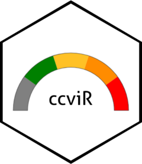

<!-- README.md is generated from README.Rmd. Please edit that file -->

```{r, include = FALSE}
knitr::opts_chunk$set(
  collapse = TRUE,
  comment = "#>",
  fig.path = "man/figures/README-",
  out.width = "100%"
)
```

# ccviR <a href="https://landscitech.github.io/ccviR/"></a>


<!-- badges: start -->
[](https://lifecycle.r-lib.org/articles/stages.html#experimental)
[](https://github.com/LandSciTech/ccviR/actions)
[](https://github.com/LandSciTech/ccviR/actions/workflows/R-CMD-check.yaml)
<!-- badges: end -->

*This application/package is under active development. Backwards compatibility is not guaranteed*

The ccviR package implements the [NatureServe Climate Change Vulnerability Index (CCVI) version 3.02](https://www.natureserve.org/conservation-tools/climate-change-vulnerability-index) in an R package and Shiny App. The package allows all of the geospatial aspects of calculating the CCVI to be done in R, removing the need for separate GIS calculations. The app provides an interactive application designed to offer a user-friendly and simple interface for calculating the NatureServe CCVI. See [Young et. al (2012)](https://www.degruyter.com/document/doi/10.7208/9780226074641-007/html) and [Young et. al. (2015)](https://doi.org/10.1002/wsb.478) for a detailed description of the index.

## Installation

You can install the development version of ccviR from [GitHub](https://github.com/) with:

``` r
# install.packages("devtools")
devtools::install_github("LandSciTech/ccviR")
```

## Launching the app

The code below will open the app in your default browser with an example data set available. 

```r 
library(ccviR)
run_ccvi_app("demo")
```
While the following will open the app with the current working directory as the default data location.

```r 
run_ccvi_app()
```

## Comparison to the NatureServe CCVI tool
 
ccviR uses the same vulnerability factors and scoring algorithm as the original NatureServe Excel spreadsheet. The index values, scores and Monte Carlo uncertainty analysis produced are the same.

### New Features
- Spatial analyses are included in the package so no GIS skills are needed. 
- Uses climate data from the whole species range rather than the range in the assessment area to score thermal and hydrological niche factors.
- Simultaneously calculates the index for multiple scenarios such as, emissions scenarios, time horizons or GCMs
- A function to classify new climate data sets into exposure categories 
- Plots that explain the drivers of the index value
- Allows the full assessment to be carried out in a reproducible environment
- Simplifies synthetic analyses across many species, groups or regions
- The  Shiny app provides a Graphical User Interface to calculate the NatureServe CCVI
- The App allows users to calculate the index without knowing R
- Makes the NatureServe CCVI accessible to a wider audience


## Additional Help

See `vignette("app_vignette", package = "ccviR")` for a more detailed description of how to use the app, `vignette("data_prep_vignette", package = "ccviR")` for how to use an app to prepare custom climate data sets, and `vignette("package_vignette", package = "ccviR")` for a tutorial on how to use the package to calculate the index directly in R.
