# Using the ccviR App

## 1 Introduction

### 1.1 What is the ccviR app?

The ccviR R package and Shiny app was developed by Environment and
Climate Change Canada (ECCC) to implement the [NatureServe Climate
Change Vulnerability Index (CCVI) version
3.02](https://www.natureserve.org/sites/default/files/guidelines_natureserveclimatechangevulnerabilityindex_r3.02_1_jun_2016.pdf)
([Young et al. 2016](#ref-young2016); [Endicott and Naujokaitis-Lewis
2024](#ref-endicott2024)). It is designed to assist land managers to
rapidly assess the relative climate change vulnerability of terrestrial
and aquatic plant and animal species, as well as lichens across North
America ([Endicott and Naujokaitis-Lewis 2024](#ref-endicott2024)). The
package allows all of the geospatial aspects of calculating the CCVI to
be done in R, removing the need for separate GIS calculations. The app
provides an interactive application designed to offer a user-friendly
and simple interface for calculating the NatureServe CCVI.

The NatureServe CCVI is a rapid assessment tool designed to allow a
relative grouping of unrelated taxa by vulnerability to climate change
and to highlight which factors contribute to the climate change
vulnerability of individual species or groups of taxa. Outputs of the
NatureServe CCVI can inform conservation decisions and identify actions
to increase species’ resilience to climate change. See [Young et. al
(2012)](https://www.degruyter.com/document/doi/10.7208/9780226074641-007/html),
[Young et. al. (2015)](https://doi.org/10.1002/wsb.478) and the
[NatureServe CCVI
Guidelines](https://www.natureserve.org/sites/default/files/guidelines_natureserveclimatechangevulnerabilityindex_r3.02_1_jun_2016.pdf)
for more detailed descriptions of the index and how it was created.

Recently NatureServe has produced a new version of the CCVI, Version
4.0. The new version builds off Version 3.02 but significantly changes
the vulnerability questions, exposure calculation and scoring algorithm.
This version of the CCVI is available as an Excel Spreadsheet or an
interactive webpage but does not have a version released for Canada.
While there are improvements in Version 4.0, many of the changes have
not yet been peer-reviewed and the tool has not been widely used so far.
On the other hand, the previous version of the NatureServe CCVI has been
used extensively in State Wildlife Action Plans in the US and has been
reviewed in several peer-reviewed papers ([Young, Dubois, and Rowland
2015](#ref-young2015); [Young et al. 2012](#ref-young2012)). Therefore,
we continue to use Version 3.02 but will consider adopting improvements
from Version 4.0 in the future.

The CCVI is designed to assess the climate change vulnerability of
terrestrial and aquatic plants, animals (including migratory species),
and lichens, within a defined geographic area of the USA and Canada
(i.e., North America). The index contemplates vulnerability based on the
projected change in climate from a baseline of 1961-1990 to the year
2050.

The NatureServe CCVI combines several components that contribute to a
species’ vulnerability to climate change (Figure
[1.1](#fig:fig-CCVI-overview)). These include, exposure to changes in
temperature and moisture (Section A), indirect exposure to other changes
brought on by climate change (e.g. sea level rise; Section B), and
traits related to species’ sensitivity or ability to adapt to climate
change (Section C). It also optionally incorporates the results of
documented or modeled responses to climate change (Section D; Young et
al. ([2012](#ref-young2012)); Young et al. ([2016](#ref-young2016))).
The resulting CCVI ranks include: ‘Less Vulnerable’, ‘Moderately
Vulnerable’, ‘Highly Vulnerable’, ‘Extremely Vulnerable’ or
‘Insufficient Evidence’. Exposure is assessed by determining the
proportion of the species’ range that falls into six classes of
temperature and moisture change, which is used to assign an exposure
multiplier. The vulnerability factors in Sections B, C and optionally D
are each scored on a scale from ‘neutral’ (score: 0) to ‘greatly
increases vulnerability’ (score: 3). The indirect exposure, sensitivity
and adaptive capacity scores are multiplied by the exposure multiplier
and summed. The final CCVI value is a result of applying thresholds to
the total scores and balancing the sensitivity and adaptive capacity
rank with the documented or modeled response rank. See Section
[7](#scoring-appendix) for a more detailed explanation of the scoring
algorithm.


Figure 1.1: The NatureServe CCVI is calculated by combining exposure to
climate change with indirect exposure, sensitivity and adaptive capacity
to determine the CCVI index value. Documented or modelled responses to
climate change can also be incorporated.

The ccviR application is run locally on the users own computer and is
not currently hosted online. Results can be saved as a csv file and a
pdf report can be generated to summarise the results.

While the CCVI is a rapid assessment tool this is relative to other
climate change vulnerability assessments and there will still be a
significant amount of time required to source information about species,
gather evidence to answer indirect exposure, sensitivity and adaptive
capacity questions and validate the results of the assessment.

### 1.2 Benefits compared to NatureServe’s CCVI:

The ccviR uses the same questions and scoring as the NatureServe Climate
Change Vulnerability Index 3.02, but offers at several improvements:

- Spatial analyses are performed by the app so only minimal GIS skills
  are needed

- Simultaneously calculates the index for multiple scenarios such as,
  emissions scenarios, time horizons or GCMs

- Outputs include interactive maps and graphs that explain the drivers
  of the index value

- Generates a report to communicate the results of the assessment

- Includes a second Shiny app to classify new climate data sets into
  exposure categories

### 1.3 What can it be used for?

The outputs of the index are designed to support stewards and scientists
to assess the relative vulnerability of species to climate change in a
defined area, called the assessment area. This area should be chosen to
reflect the scale at which the results of the assessment will be
applied. Results for multiple species can be compared directly as long
as the same assessment area and climate data are used in all the
assessments.

According to Young et al., (2016), the outputs can be used to:

- Determine which species are most vulnerable to climate change within
  the assessment area.

- Identify common drivers of vulnerability for species in an area.

- Standardise assessment, improve communication, and facilitate
  coordination of climate change action across jurisdictional
  boundaries.

- Help prioritise management actions for species (when combined with
  other ecological, social and economic factors of importance to
  planning, such as species status, recoverability, and cost).

- Identify where refugia may exist for planning and protection.

- Identify where information gaps are impeding assessment and management
  of species relevant to climate change vulnerability and management to
  help prioritise subsequent research efforts.

In addition, the results of the CCVI can be used to help inform risk
assessments and recovery planning for species. While the scoring
criteria and thresholds do not directly link to other assessment
frameworks (e.g. the IUCN-CMP threat classification system), the
information gathered for the CCVI assessment and presented in the
results can be applied and re-interpreted to inform other assessments.
See [Appendix
A](https://github.com/LandSciTech/ccviR/tree/master/inst/appendices/Vignette_appendices.pdf)
for a detailed explanation of how the ccviR outputs can inform COSEWIC
Status Reports and the creation of Recovery Strategies.

### 1.4 Known limitations

- Not for use outside of North America.

- Assumes a temporal scale to 2050.

- Not applicable to marine species.

- Does not provide probabilistic information on species decline but
  rather a relative rank.

## 2 Information you need to get started

The ccviR requires assessors to provide spatial information and a series
of judgements to inform questions about exposure, sensitivity and
adaptive capacity. In this section we outline some key requirements and
minimum information needs. More information on these factors and the
rationale for their consideration is provided in the [NatureServe CCVI
Guidelines](https://www.natureserve.org/sites/default/files/guidelines_natureserveclimatechangevulnerabilityindex_r3.02_1_jun_2016.pdf)
([Young et al. 2016](#ref-young2016)). See Section
[4.1](#new-assessment) for tips on how to organize this information.

### 2.1 Installing R and the ccviR package

The ccviR Application is launched from an open source software
application called R. You will need to [download R and optionally
RStudio](https://rstudio-education.github.io/hopr/starting.html) to use
the app. Instructions to launch the app are shown below. Users do not
need to know how to code in R, however, familiarity with R can be
helpful.

Next you will need to install the ccviR package by copying the following
into the R Console and pressing Enter. The R Console is the window
located in the bottom left of RStudio. A “\>” at the start of a line
indicates that the console is ready for input.

``` r
install.packages("remotes")
remotes::install_github("LandSciTech/ccviR", type = "binary", upgrade = TRUE)
```

This will take several minutes the first time it is installed because it
will also install other packages that ccviR depends on. You can ignore
the text that is printed, this is just reporting on the installation
progress.

### 2.2 Spatial data

Below are the required and optional data layers for a ccviR analysis.
Section [5](#apply-index) provides information on sourcing spatial data.
The ccviR assumes that users have an introductory level of knowledge and
experience relevant to reviewing spatial data. If this is not the case,
then we recommend finding someone who has some GIS experience to help
find and review data layers for your first analysis. All polygon data
should be provided as a
[shapefile](https://en.wikipedia.org/wiki/Shapefile) while [raster
data](https://en.wikipedia.org/wiki/GIS_file_format#Raster_formats) can
be in any common raster format but the [GeoTiff
(“.tif”)](https://en.wikipedia.org/wiki/GeoTIFF) format is recommended.

**Required** spatial datasets are as follows (Refer to Section
[5](#apply-index) for additional information):

- *Climate data (required):* Climate data has already been prepared for
  use in the ccviR. You will need to [download the
  data](https://drive.google.com/file/d/1znRcuIukvuAu7YAoL4WfxLulcszv4Dkq/view?usp=drive_link)
  and unzip it to use it in the app. The prepared data uses the
  1961-1990 normal period for historical data and the 2050s timeframe
  and the RCP 4.5 and RCP 8.5 scenarios for future projections. The
  climate data should be the same of all species assessed, so you will
  only need to download it once even for multiple assessments. See
  [“Preparing Custom Climate
  Data”](https://landscitech.github.io/ccviR/articles/data_prep_vignette.html)
  for how to use a different climate data set.

- *Species North American or global range polygon (required):* Ideally
  this is the complete area occupied by the species in North America
  including areas outside the assessment area.

- *Assessment area polygon (required):* The management area within North
  America for which the species vulnerability is being assessed. For
  example, a country, province, state, or protected area.

**Optional** species-specific spatial datasets that are useful for
specific analyses:

- *Physiological thermal niche (PTN) polygon (Optional*): The PTN
  polygon should include cool or cold environments occupied by the
  species that may be lost or reduced in the assessment area because of
  climate change. This could include species restricted to frost
  pockets, north-facing slopes, shady ravines, or alpine areas if these
  are among the coldest habitats in the assessment area so the species
  is unlikely to be able to shift within the assessment area if these
  cool areas are lost. If spatial data for the PTN is not available the
  question can be answered manually or left as unknown. It is rare to
  have spatial data for the physiological thermal niche so it should be
  filled in manually in most cases.

- *Non-breeding range polygon (Optional):* For migratory species provide
  a polygon of the species’ range in the non-breeding season.

- *Projected range change raster (Optional):* The modeled change in the
  species range caused by climate change. The values of the raster cells
  should indicate whether the cell was lost, maintained, gained or was
  never included in the range. This dataset is used in the modeled
  response analysis to determine the proportion of habitat that will be
  lost, maintained, or gained within the assessment area.

- *Protected area polygon (Optional):* This is only relevant if a
  projected range change raster is supplied. Polygon data for all
  protected areas in Canada and the United States has already been
  prepared for use in the ccviR. You will need to [download the
  data](https://drive.google.com/file/d/1znRcuIukvuAu7YAoL4WfxLulcszv4Dkq/view?usp=drive_link)
  and unzip it to use it in the app. Note that because this is a large
  file running the spatial analysis and rendering maps will take longer
  when the protected areas polygons are supplied.

### 2.3 Vulnerability information

Assessors are required to provide estimates for at least 13 factors in
the vulnerability assessment section (Table [2.1](#tab:c-b-questions)).
This must include information on at least:

- 3 factors in Section B, and

- 10 factors in Section C.

Additional questions related to documented or modeled response (Section
D) are optional (Table [2.2](#tab:d-questions)). Questions may be left
blank if there is not enough information available to answer them but
they will be given a score of 0 meaning they will have no impact on the
index value. Assessors should expect many questions to be scored as
‘neutral’ since only a few vulnerability factors will be relevant to
each species. The index can reach the ‘Extremely Vulnerable’ level with
only 1-2 factors scored as ‘greatly increases vulnerability’ if exposure
is high.

To better understand the information required to score each factor refer
to the [NatureServe CCVI
Guidelines](https://www.natureserve.org/sites/default/files/guidelines_natureserveclimatechangevulnerabilityindex_r3.02_1_jun_2016.pdf)
([Young et al. 2016](#ref-young2016)).

| Question ID | Parameter                                                                         | Response categories[\[1\]](#id__ftn1) | Exposure Multiplier applied[\[2\]](#id__ftn2) |
|-------------|-----------------------------------------------------------------------------------|---------------------------------------|-----------------------------------------------|
| B1          | Proportion of range lost to sea level rise                                        | GI, I, SI, N                          | None                                          |
| B2          | Natural barriers                                                                  | GI, I, SI, N                          | Combined                                      |
| B2          | Anthropogenic barriers                                                            | GI, I, SI, N                          | Combined                                      |
| B3          | Land use changes resulting from human responses to climate change                 | I, SI, N                              | Combined                                      |
| C1          | Dispersal and movements                                                           | GI, I, SI, N                          | Combined                                      |
| C2ai        | Predicted sensitivity to temperature changes (historical thermal niche)           | GI, I, SI, N                          | Temperature                                   |
| C2aii       | Predicted sensitivity to temperature changes (physiological thermal niche)        | GI, I, SI, N                          | Temperature                                   |
| C2bi        | Sensitivity to moisture changes (historical thermal niche)                        | GI, I, SI, N                          | Moisture                                      |
| C2bii       | Sensitivity to moisture changes (physiological thermal niche)                     | GI, I, SI, N                          | Moisture                                      |
| C2c         | Dependence on specific disturbance regimes impacted by climate change             | I, SI, N                              | Combined                                      |
| C2d         | Dependence on ice, ice-edge, permafrost, snow habitats                            | GI, I, SI, N                          | Combined                                      |
| C3          | Restriction to uncommon geological features and derivatives                       | I, SI, N                              | Combined                                      |
| C4a         | Dependence on other species to generate habitat                                   | I, SI, N                              | Combined                                      |
| C4b         | Dietary versatility **(animals)**                                                 | I, SI, N                              | Combined                                      |
| C4c         | Pollinator versatility **(plants only)**                                          | I, SI, N                              | Combined                                      |
| C4d         | Dependence on species for dispersal                                               | I, SI, N                              | Combined                                      |
| C4e         | Sensitivity to pathogens or natural enemies                                       | I, SI, N                              | Combined                                      |
| C4f         | Sensitivity to competition from native or non-native species                      | I, SI, N                              | Combined                                      |
| C4g         | Other Interspecific interactions                                                  | I, SI, N                              | Combined                                      |
| C5a         | Measured genetic variation                                                        | I, SI, N                              | Combined                                      |
| C5b         | Occurrence of bottlenecks **(only answered if C5a not known)**                    | I, SI, N                              | Combined                                      |
| C5c         | Reproductive system **(only answered if C5a and C5b not known)**                  | I, SI, N                              | Combined                                      |
| C6          | Phenological response to changing seasonal temperature or precipitation dynamics. | I, SI, N                              | Combined                                      |

Table 2.1: Vulnerability factors assessed in the CCVI.

[\[1\]](#id__ftnref1) GI = Greatly increases (3), I= Increases (2), SI=
Somewhat increases (1), N= Neutral (0).

[\[2\]](#id__ftnref2) Scores for each vulnerability factor a multiplied
by an exposure multiplier determined by the climate data. See Section
[7](#scoring-appendix) for more details on scoring.

|             |                                                              |                                       |
|-------------|--------------------------------------------------------------|---------------------------------------|
| Question ID | Parameter                                                    | Response categories[\[1\]](#id__ftn1) |
| D1          | Documented response to recent climate change                 | GI, I, SI, N                          |
| D2          | Modeled future (2050) change in population or range size     | GI, I, SI, N                          |
| D3          | Overlap of modeled future 2050 range with current range      | GI, I, SI, N                          |
| D4          | Occurrence of protected areas in modeled future distribution | GI, I, SI, N                          |

Table 2.2: Documented or modeled responses to climate change assessed in
the CCVI.

[\[1\]](#id__ftnref1) GI = Greatly increases (3), I = Increases (2), SI
= Somewhat increases (1), N = Neutral (0)

## 3 Run a demonstration

Before using the app to assess a real species follow along with this
tutorial that walks through the app with a demo dataset that is included
in the ccviR package. The tutorial explains how to navigate through the
app and how to interpret the outputs created by the app.

If you have not already installed ccviR, begin by installing the ccviR
package from [GitHub](https://github.com/) with:

``` r
install.packages("remotes")
remotes::install_github("LandSciTech/ccviR@dev", type = "binary", upgrade = TRUE)
```

Then, run the code below to launch the app in your browser with the demo
data:

``` r
library(ccviR)
run_ccvi_app("demo")
```

This will open your browser in a new tab, note that closing either the
browser window or the R/Rstudio window will close the assessment.

### 3.1 Getting started

Upon launching the app, you are greeted with the Welcome Tab which
includes the option to start a new assessment or load a previously saved
assessment. It also includes a button to download definitions for the
columns included in the csv file for saved assessments.

Press “Start” to begin calculating the index.

### 3.2 Assessment and Species Information

On this page, you will provide some basic details about the assessment
and species. The “Assessment Notes” text box should be used to capture
any details about the assessment process that are not recorded
elsewhere. This should include the strategy used to gather evidence to
inform the assessment, links to data sets used, etc.

Make sure to select the appropriate taxonomic group since some aspects
of the index are conditional on this. To better understand the meaning
of the cave dwelling and migratory check boxes see the [NatureServe CCVI
Guidelines](https://www.natureserve.org/sites/default/files/guidelines_natureserveclimatechangevulnerabilityindex_r3.02_1_jun_2016.pdf).

For this demonstration select “Bird” from the Major Taxonomic Group drop
down and check the box for migratory species. Input any text for the
remaining boxes. Click “Next”.

### 3.3 Spatial Data Analysis

On this page, you will load the spatial data used by the index and run
the spatial analysis for exposure to climate change.

For this demonstration, all of the data is provided in the package. This
includes a small climate change data set covering New Brunswick for the
RCP 4.5 and RCP 8.5 emissions scenarios, Climate Change Exposure Index
rasters for migratory species, a species range polygon, an assessment
area polygon, a PTN polygon, a protected areas file, and range change
rasters for both RCP 4.5 and RCP 8.5 scenarios.

For the “Folder location of prepared climate data” you need to tell the
app where you stored the climate data that it should use. For a real
assessment this will either be the folder that you unzipped the
downloaded climate data into or the output folder you selected in the
data preparation app. For this demonstration the prepared climate data
can be found under “clim_files \> processed”. Click on the processed
folder then click Select in the bottom right of the pop-up.

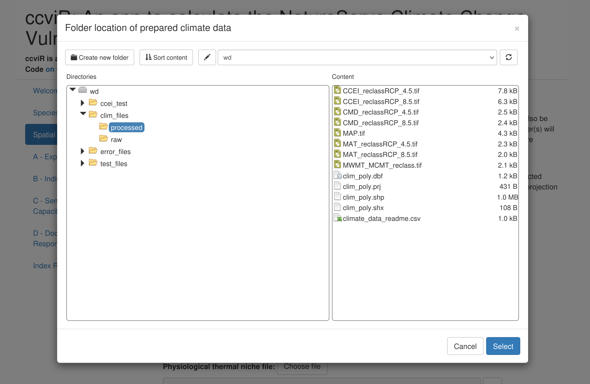

Next, select the range polygon for the species (“rng_poly.shp”), the
assessment area polygon (“assess_poly.shp”), the physiological thermal
niche polygon (“ptn_poly.shp”), the non-breeding range polygon
(“non_breed.shp”), and the protected area polygon
(“protected_areas.shp”).

For the projected range change raster, select “Yes, multiple range
change rasters will be provided, one for each scenario.” This will open
a new section where you can select a raster file for each scenario.
Select “rng_chg_45.tif” for the RCP 4.5 scenario and “rng_chg_85.tif”
for the RCP 8.5 scenario. If range change rasters are not available for
each scenario, a single raster can be used but this assumes the
projected range change is the same in all scenarios.

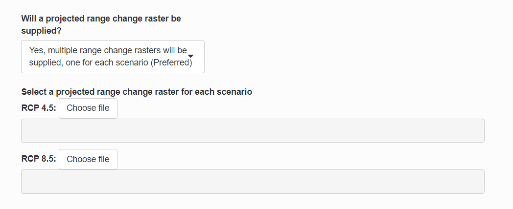

Next, specify how the input raster should be classified into lost,
gained, maintained or not suitable. The classification will depend on
the values of the raster you are working with. For this demonstration,
use the default values which are for a raster where lost is -1,
maintained in 0, and gained is 1. Not suitable is not used so it is
flagged with 99.

The the gain multiplier allows you to ignore gains by setting it to 0
but we will leave it at 1 which assumes that the model has already
accounted for whether habitat gains are likely to be realized.

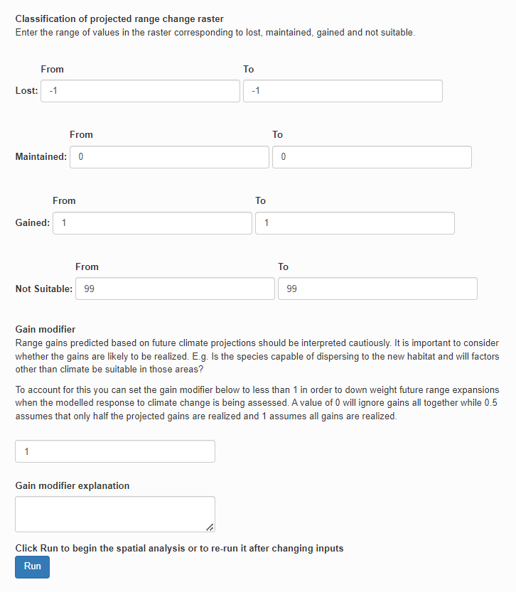

Then, click “Run Spatial Analysis”. The progress bar in the bottom right
will show while the data is being processed. When the “Complete” message
appears, click “Next”.

### 3.4 Section A - Exposure Results

The Exposure Results page displays the results of the spatial data
analysis as interactive maps of climate change exposure. Exposure is
determined by the change in temperature or moisture that is expected to
occur in the future within the species range in the assessment area.

The exposure maps are created by subtracting the future climate from the
historical climate and classifying the results into six classes (low to
high level of exposure) based on the median and 1/2 the interquartile
range. Thus, negative values for temperature indicate warmer conditions
(°C) and negative values for moisture (mm) indicate drier conditions.
The tables below the maps outline the classes and the proportion of the
species range in each class. The exposure multiplier is determined by
the level of exposure. It is used to modify the sensitivity and adaptive
capacity components of the index based on exposure to climate change.
See Section [7](#scoring-appendix) for more details.

To view the map for different scenarios uncheck the box next to the last
layer to reveal the one underneath. The real climate data will cover all
of North America but for the demonstration we are using a subset from
New Brunswick.

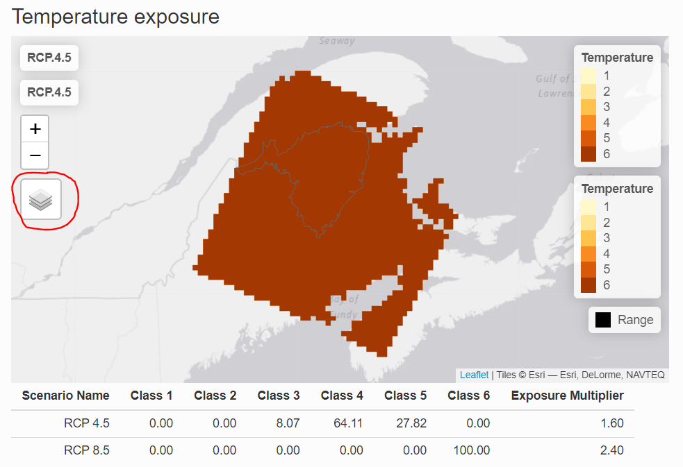

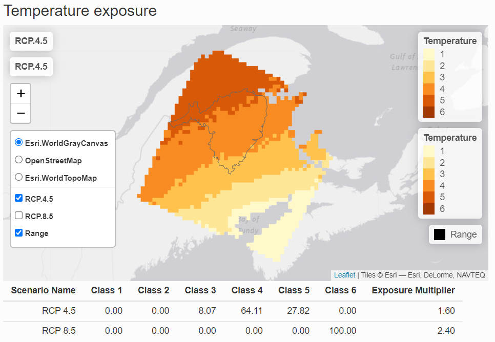

The non-breeding range of the species is used to determine the migratory
exposure index based on the climate change exposure index (CCEI). The
CCEI is a metric of climate change exposure that indicates the level of
exposure to both temperature and moisture change using the Euclidean
distance. See the NatureServe guidelines for a full description. The
CCEI is broken into four categories of exposure and the proportion of
the non-breeding range overlapping each category is used to determine
the migratory exposure index value.

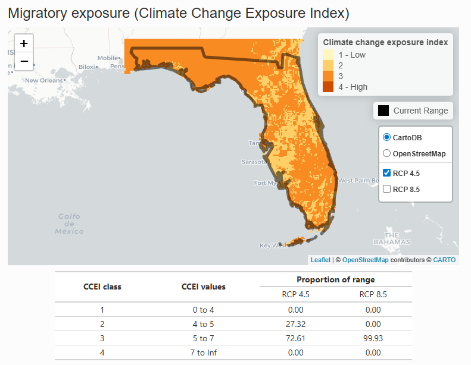 These maps can be used to explore the spatial
distribution of the species’ exposure to climate change. While the index
will produce one value for the whole species range, the exposure maps
can be explored to find areas with more or less exposure which could be
prioritized as areas in need of special attention or areas that could
serve as climate refugia.

Once you have finished exploring the maps click “Next”.

### 3.5 Sections B, C, D - Vulnerability Questions

Vulnerability questions are detailed questions that the index uses to
score the species’ indirect exposure, sensitivity, adaptive capacity and
modeled or documented responses to climate change. Descriptions of how
to interpret and score the questions are available in the NatureServe
guidelines which are included as a pop-up if you click the “i” button
next to each question. To ensure the index is consistently applied **you
must read the guidelines for each question before answering it.**

There are three sections of vulnerability questions: *Section B:
Indirect Exposure to Climate Change*, *Section C: Sensitivity and
Adaptive Capacity*, and *Section D: Documented or Modeled Response to
Climate Change*. Section B and Section C are required - if less than 13
of the 24 questions are answered the index result will be “Insufficient
Evidence”. Section D is optional - if none of the questions are answered
the index will be calculated without it.

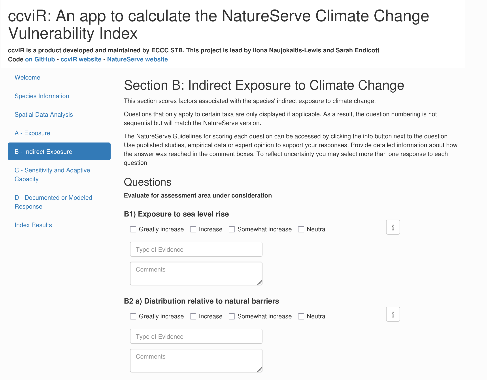

Answering the vulnerability questions for a real species will be a
significant task requiring expert knowledge and or a detailed literature
search. See Section [5.7](#gathering-evidence) for more information on
how to go about this.

For the demonstration, you can select any check box that you want for
each question. You can check more than one box to reflect uncertainty.
When multiple boxes are selected they will all be treated as equally
likely. Questions that are unknown can be left blank. Try a few
different versions and see how it affects the result! For each question
there is an evidence dropdown box where you can select all the sources
of evidence you used and a comment section. These should be filled in
with detailed information on how the answer was reached and a
description of the evidence that was used to support the assessment. The
size of the comment box can be increased by dragging from the bottom
right corner. Remember to click the save button frequently as you do
through the app so that you will not lose any information.

Some of the sections have questions that have a spatial component. Each
of these questions includes a map and table showing how the data has
been summarized. The check box is pre-selected based on the spatial data
analysis but can be changed if needed.

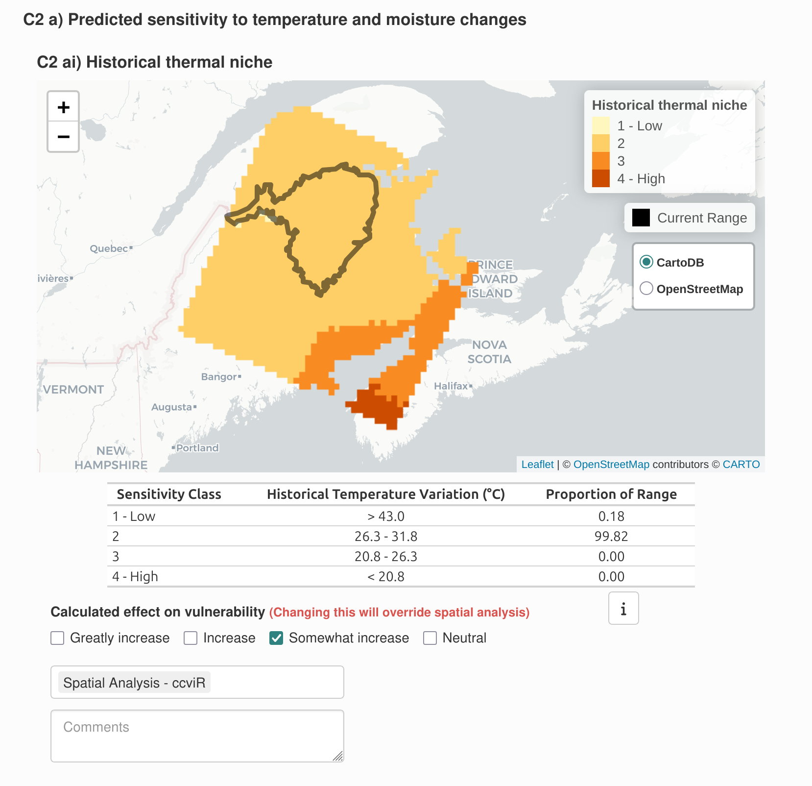

The modeled response to climate change will be different depending on
the climate change scenario used. If a range change raster has been
supplied for each scenario the modeled future range change map and
protected areas map includes a layer for each scenario which can be
toggled on or off in the same way as the exposure maps. The responses to
these questions can not be edited when multiple scenarios are used.

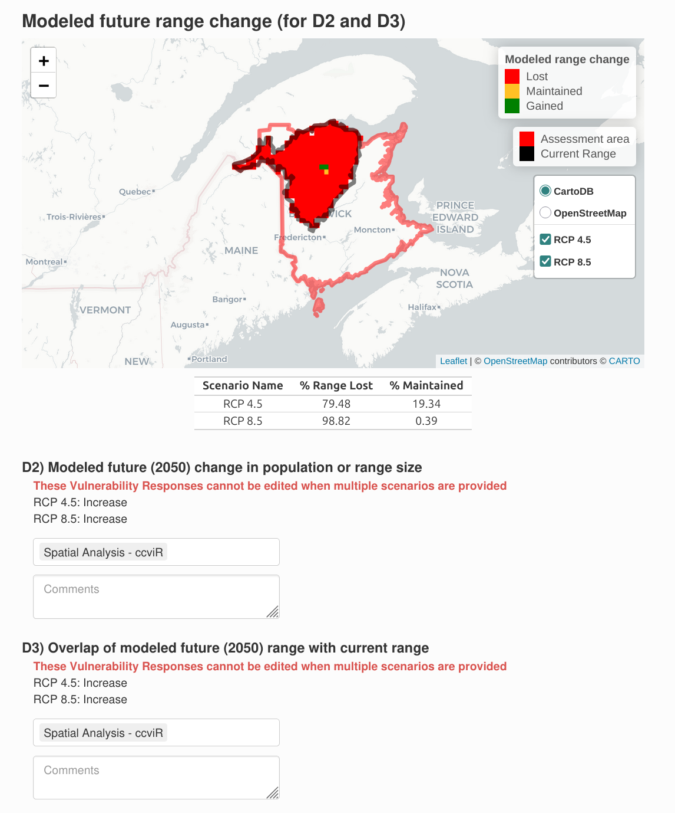

Note that if a check box for a spatial question is changed and then the
“Run Spatial Analysis” button is clicked again, you will see a warning
that the value of the check boxes for questions with a spatial component
will be updated to the value based on the re-run spatial analysis. The
‘Spatial Vulnerability Questions’ comments will not be affected though,
so you can explain the reason for any adjustments in the comments and
then remake those adjustments if they are still applicable. If the
spatial data for a vulnerability question was not provided on the
‘Spatial Data Analysis’ tab then the map will not be included and the
question can be answered using non-spatial information or left blank for
unknown.

Click “Next” when you have answered the questions in each section.

### 3.6 Index Results

On the Index Results page, the first section highlights Data
Completeness: how many questions were answered in each section, whether
a sufficient number have been answered, and how many are did not specify
the type of evidence used. The index is more reliable when more
questions are answered. You can return to specific Sections to add more
evidence or answer more questions if there is insufficient Data
Completeness.

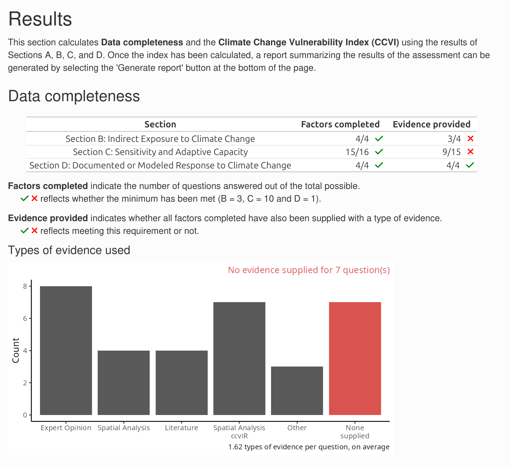

Next, click “Calculate CCVI” to calculate the index value. Once
finished, the first section presents the Climate Change Vulnerability
Index and Migratory Exposure Index for each climate scenario.

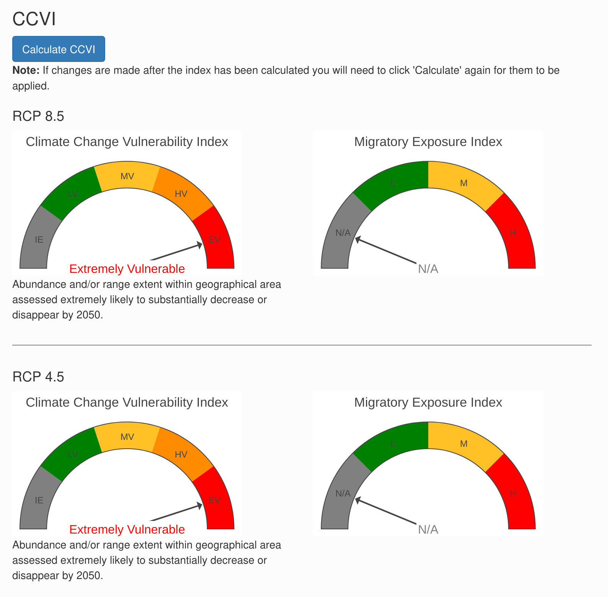

To account for uncertainty in the vulnerability questions you can
provide more than one answer to each question. The for each question the
average score across all the checkboxes selected is used to calculate
the final index but the uncertainty in the index value is also explored
using Monte Carlo simulations. In each simulation one of the selected
values is picked for each vulnerability question and the index is
re-calculated. This is repeated 1000 times. This process assumes that
all the checkboxes selected for the question are equally likely. The
Variation in Index bar chart shows the proportion of simulations that
had each index value for each scenario. If all the simulations had the
same index value then the uncertainty in the answers to vulnerability
questions does not influence the index. If the index values are
different then the index value is less certain.

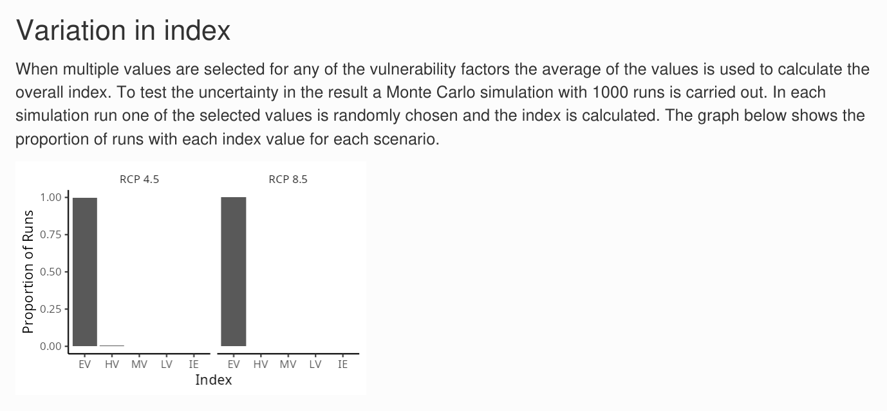

The next graph shows how the scores based on the exposure and the
sensitivity and adaptive capacity (Sections A, B and C) are combined
with the scores based on the documented or modeled response to climate
change (Section D), to produce the qualitative index value. The colours
show the location of the thresholds used to determine the index, the
points show the score for each scenario and the lines show the range of
scores produced by the Monte Carlo simulations. More details on the
scoring algorithm can be found in Section [7](#scoring-appendix).

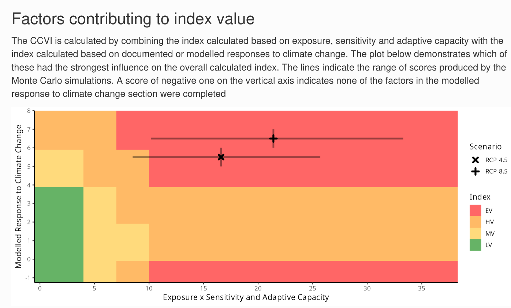

The last graph shows the scores for each vulnerability factor in each
scenario. The scores reflect the answer to the question and the exposure
multiplier that was applied. Use the mouse to show the pop-up for each
bar to get more details on how the score was reached.

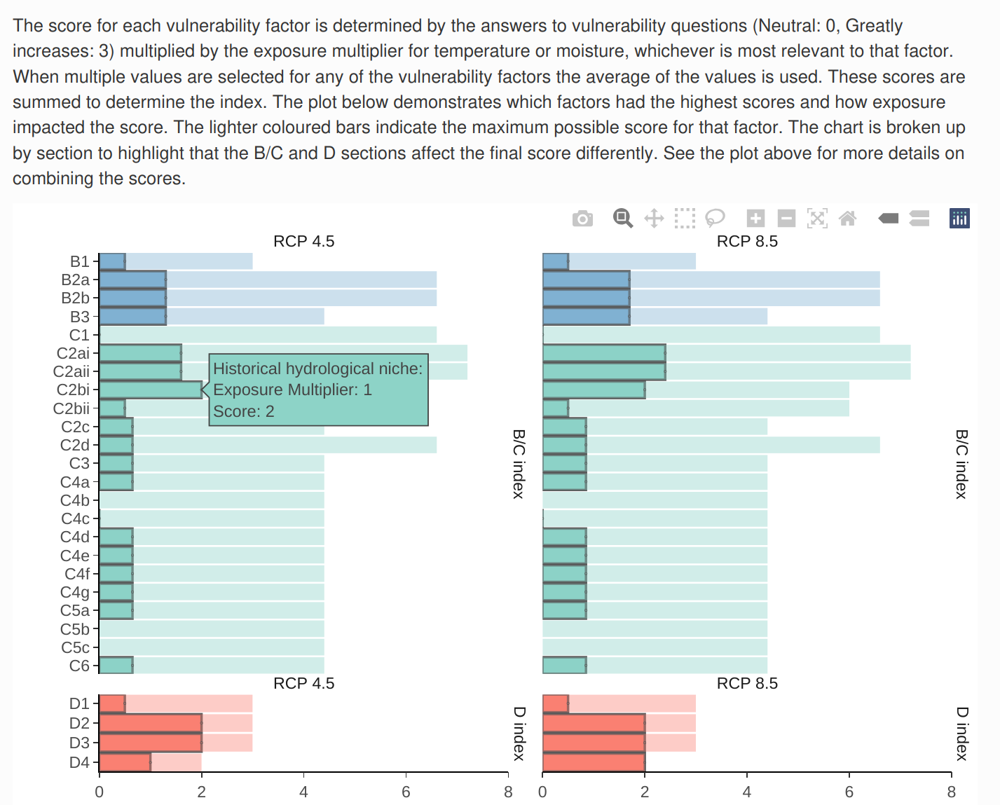

If you go back and change the answer to a vulnerability question you
will need to click the “Calculate CCVI” button again to see the updated
results.

### 3.7 Render a report

You can generate a pdf report summarizing the results of the assessment
by clicking the “Generate report” button at the bottom of the results
page. The report produced will include the index value, a map of the
range, a map of the combined moisture and temperature exposure, and the
response to each vulnerability question including the types of evidence
used and the text from the comment section. Once rendered, the report
will appear in your downloads. Rendering this report requires that you
have Chrome, Chromium, or Edge installed on your computer. If you are
missing this, a message will appear to let you know.

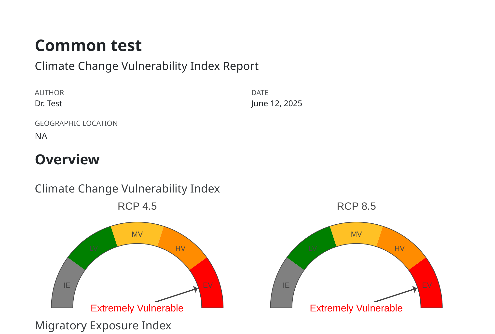

### 3.8 Saving the app

The state of the app can be saved by clicking the “Save progress” button
at the bottom of the app at any point in the assessment. Choose a name
and location to save a csv file with all the app content that is easy to
remember, you will need to find it again to load the saved app. To load
the app from a saved csv file click “Select file” under “Load data from
a previous assessment” at the bottom of the Welcome page and select the
saved csv file.

Note, only the path to the spatial data is stored, not the data itself,
so the app will not be able to load if data is moved or its name is
changed. If the data has moved, you will get an error message but you
can go back to the Spatial Analysis tab and select the new file location
and then press “Run Spatial Analysis” which will re-run the spatial
analysis (including any spatial questions you manually specified) but
will keep the answers to the non-spatial vulnerability questions from
the saved file.

Be sure to save your progress throughout the assessment to prevent the
loss of data. Refreshing the app or closing R/RStudio will result in
your progress being lost. It is recommended that you save your progress
before you step away from the assessment for an extended period of time
or after you input data that would be difficult/time consuming to
reproduce (e.g. filling out Vulnerability Questions).

When the app is closed in the browser a temporary csv file is stored in
the users “Temp” folder in case the app was closed unintentionally. To
find this file, copy and paste the path shown in the R Console after the
app closes into your File Explorer and save the file to a permanent
location.

To interpret the names of the columns in the saved csv file you can
download the column definitions from the bottom of the Welcome page.

If you have made changes to the questions *after* running the Index
calculations you will get a message indicating that the Index scores
will not be saved. This is to prevent saving index scores which do not
match the questions answered. To save Index scores, re-calculate the
Index and then “Save progress”.

## 4 Tips for using the app

### 4.1 Starting a new ccviR assessment

Organizing the files used in your assessment within one folder will make
it easier to find your files in the app. Follow these steps to setup a
new project:

1.  Open RStudio

2.  Click File \> New Project…

3.  Select New Directory, then New Project

4.  Give your new directory (aka folder) a meaningful name and use the
    Browse button to choose where to store it in your existing files.

5.  Click Create Project. This will open the new project in RStudio.

6.  Navigate to the directory you created in Step 4. In the Windows File
    Explorer you will see that a new folder has been created with the
    name you chose and it will contain a “.Rproj” file.

7.  This is the folder where you should store all the information
    related to the assessment. You can add any sub-folders that make
    sense for your assessment. For example, you could add a folder for
    each species you will assess, or separate folders for input data and
    saved results from the app.

8.  This folder is also where you should unzip the climate data package,
    which can be downloaded
    [here](https://drive.google.com/file/d/1znRcuIukvuAu7YAoL4WfxLulcszv4Dkq/view?usp=drive_link).

Now you are ready to start your assessment!

### 4.2 Launching the app

The app is launched by typing
[`run_ccvi_app()`](https://landscitech.github.io/ccviR/reference/run_ccvi_app.md)
in the R Console and hitting Enter. The R Console is the window located
in the bottom left of RStudio. A “\>” at the start of a line indicates
that the console is ready for input. This will launch the app in the
user’s default internet browser. All file selection windows will start
in the current working directory. To run the app with data stored in a
different folder you can call
[`run_ccvi_app()`](https://landscitech.github.io/ccviR/reference/run_ccvi_app.md)
with the folder path as the first argument. For example, if all of my
data is stored in a subdirectory of the working directory named “data”,
I would call `run_ccvi_app("data")` to avoid having to open the data
folder every time I select a file. Alternatively, the complete path to
the data folder can be supplied
e.g. “C:/Users/username/Documents/path/to/folder” (Note that paths in R
must be supplied using forward slashes).

### 4.3 Multiple related assessments

You can use a saved partially completed assessment as a template for
running multiple related assessments. For example, to assess multiple
populations of a species that are in different locations and may have
different stressors, fill in the app with all the information that will
not change between populations and save the state of the app in a csv by
clicking “Save Progress”. Then for each population launch a new
assessment, click “Load from a previous assessment” and select your
template csv. Then modify it for the specific population and save the
completed assessment in a new csv file. You may also wish to complete
multiple assessments for a species if you want to enter different
answers for vulnerability questions depending on the climate change
scenario used. Multiple climate scenarios can be included in a single
assessment and will affect the exposure multiplier and optionally the
modelled response to climate change. However, all other vulnerability
questions are assumed to be constant across scenarios. For example, if
sea level rise was expected to have a different impact under RCP 8.5
than 4.5 you would need to perform two separate assessments to reflect
this.

### 4.4 Troubleshooting

If you have a problem in the app you can look at the output in the R
Console for a clue about what is going wrong. The output will include
messages, warnings and any error messages that are produced. You can
ignore warnings unless something else has gone wrong. Most errors will
show in the app but in some situations the app will go grey and the
error message can be found in the R console. If the problem is realated
to spatial data inputs it may be necessary to open the spatial files in
a GIS application (e.g, QGIS or ArcGIS) to investigate the problem.

If you are unable to solve a problem on you own, you can ask a question
or report an issue through the package GitHub
[page](https://github.com/LandSciTech/ccviR/issues). When submitting an
issue be sure to include enough information so the app developers can
recreate the problem you are experiencing. This should include
screenshots of any error messages received, links to the data that
produced the error and a description of the steps needed to reproduce
the error.

## 5 Scientific considerations for applying the index

In this section we explore the details of how the index is calculated
and how that should inform decisions made about the data and evidence
that should be used.

### 5.1 Climate data

The climate data used in the app contains five raster files that
summarise different aspects of climate used in the index.

- Difference between the historical and future mean annual temperature
  (MAT). Used to determine exposure to temperature change.
- Difference between the historical and future climate moisture deficit
  (CMD). Used to determine exposure to change in moisture regime. CMD is
  the potential evapotranspiration minus the amount of precipitation and
  accounts for the impact of increased temperatures on water stress.
- Historical mean annual precipitation (MAP). Used to assess the amount
  of variation in MAP across locations in the species range to answer
  question C2bi.
- Difference between historical maximum warmest month temperature (MWMT)
  and minimum coldest month temperature (MCMT). Used to approximate the
  amount of broad scale temperature variation the species has
  experienced historically across its range to answer question C2ai.
- Climate Change Exposure Index (CCEI). The CCEI is a metric of climate
  change exposure that indicates the level of exposure to both
  temperature and moisture change using the Euclidean distance. See
  Section [5.4](#migratory) for a full description. The overlap between
  the CCEI and the non-breeding range polygon is used to determine the
  Migratory Exposure Index.

The data is classified based on the median and interquartile range for
the future change in MAT and CMD and based on thresholds defined by the
NatureServe Guidelines for MAP and MWMT-MCMT.

If you wish to create your own climate data set for use with the index
based on different climate data you can follow the instructions in
[“Preparing Custom Climate
Data”](https://landscitech.github.io/ccviR/articles/data_prep_vignette.html).

When using the app to assess multiple different species the same climate
data set should be used for all species because the index is relative so
the results cannot be compared across different species if different
data sets are used.

### 5.2 Species range

Ideally the range polygon is the complete area occupied by the species
in North America. The full range is used to determine the range of
climate conditions that the species can tolerate to answer the questions
about historical thermal niche (C2ai) and historical hydrological niche
(C2bi). The portion of the range that is within the assessment area (see
below) is used to determine the species exposure to climate change.

Choosing or creating an appropriate range polygon can be challenging
because for many species comprehensive surveys of locations where the
species could occur have not been conducted. As a result it is difficult
create a range polygon based on point locations where the species has
been found because we do not know whether it is present between those
locations or at other locations that have not been surveyed. For the
purposes of the CCVI a polygon that represents the broad area where the
species is known to occur will be sufficient as the climate data used is
on a 1 km by 1km grid and is classified into broad categories to assess
qualitative vulnerability factors. When choosing a polygon it is
important to consider how the polygon is used. If the polygon includes
areas where the species does not occur the spatial analysis could over
estimate the historical niche, while if occupied areas are excluded
because they have not been surveyed the historical niche could be
underestimated. Again, small changes in range boundaries are unlikely to
affect the index value so the range polygon does not need to be exact.

Existing range polygons can be found online for many species (Table
[5.1](#tab:range-sources)). Ensure that the polygon is from a reputable
source and that it does not include historical or future occurrences. If
you can not find an appropriate range polygon you can create one from
occurrence data. If you are not a species expert, we recommend using the
[sRedList tool](https://www.iucnredlist.org/resources/sredlist) as it
has an interactive user interface that can guide you through creating a
polygon. To use the tool you will need to create an account and login,
then click assessments on the left-hand menu. Then on the “Distribution”
page select “Create from occurrence records”. You will need to move
through all the steps but can skip the ones that are not relevant and
then download a zip file containing the species range at the end.

|                           |                                                                                                                                  |                          |                                                                                                                                                                               |
|---------------------------|----------------------------------------------------------------------------------------------------------------------------------|--------------------------|-------------------------------------------------------------------------------------------------------------------------------------------------------------------------------|
| **Name**                  | **About**                                                                                                                        | **Location**             | **URL**                                                                                                                                                                       |
| SRedlist                  | Create range maps from global occurrence data.                                                                                   | Global and local         | <https://www.iucnredlist.org/resources/sredlist>                                                                                                                              |
| NatureServe EBAR          | Accessible range maps and *shapefiles* for priority species. These are at a coarse scale and appropriate for screening purposes. | North America            | <https://www.natureserve.org/canada/ebar#downloads>                                                                                                                           |
| IUCN                      | Range maps and *shapefiles* for a large number of IUCN listed species.                                                           | Global                   | <https://www.iucnredlist.org/resources/spatial-data-download>                                                                                                                 |
| ECCC Data range map       | Range polygons for Species at Risk in Canada                                                                                     | Canadian                 | [https://catalogue.ec.gc.ca/geonetwork/srv/eng/catalog.search#/](https://catalogue.ec.gc.ca/geonetwork/srv/eng/catalog.search#/metadata/d00f8e8c-40c4-435a-b790-980339ce3121) |
| USGS Gap Analysis Project | Range data and polygons for listed and common species in the USA.                                                                | United States of America | <https://www.usgs.gov/programs/gap-analysis-project>                                                                                                                          |

Table 5.1: Potential data sources for species range polygons

### 5.3 Assessment area

The assessment area is the area within which the species vulnerability
is being assessed. For example, a country, province, state, or protected
area. This polygon is intersected with the species range to create the
polygon used to determine the exposure to climate change. To calculate
exposure the range within the assessment area is overlain on the
exposure raster and the proportion of the range covered by each class is
determined and used to calculate exposure multipliers for temperature,
moisture and a combined multiplier. These exposure multipliers are used
to modify the scores from the sensitivity questions in order to reach
the total score. The assessment area is also used in Section D to
determine the portion of the assessment area that will be part of the
projected future range.

The assessment area can also be the boundary of one sub-population if
you wish to assess the vulnerability of a sub-population of the species.
This way the range polygon for the whole species can still be used to
determine the historical niche while the exposure and future range
change are assessed within the sub-population.

The NatureServe CCVI was designed to be applied to wildlife within a
national park, wildlife refuge, or state ([Young et al.
2016](#ref-young2016)) but it can also be applied to larger areas
including a species’ entire range in North America (Need to cite). When
applied to larger areas the assessment may mask high vulnerability in
particular areas but the exposure maps produced in the assessment could
be used to identify these areas.

The spatial scale for an assessment area should be chosen to reflect the
scale at which the results of the assessment will be applied. It is also
important to consider the assumptions that are created by the choice of
scale and if they are not met address them. 1) the species’
vulnerability inside the assessment area is not affected by its
vulnerability in other parts of its range; 2) the species’ vulnerability
is constant across the assessment area; 3) The species’ traits are the
same across the range and assessment area. To address these assumptions
assessments can be performed separately for different sub-populations
and for the full species range.

### 5.4 Migratory species

The CCVI includes a Migratory Exposure Index that was added to account
for the exposure of species to climate change while in their migratory
range. It uses a Climate Change Exposure Index (CCEI) map overlapped
with the species non-breeding range to determine an exposure index value
of Low, Moderate or High. This can be used along side the CCVI index
value for the assessment area.

The CCEI is created by calculating the standard Euclidean distance
between the historical MAT and CMD and the projected future MAT and CMD.
The CCEI is broken into four categories of exposure and the proportion
of the non-breeding range overlapping each category is used to determine
the migratory exposure index value. The categories are based on
thresholds defined in the NatureServe Guidelines.

### 5.5 Range change raster

The range change raster is used to score the vulnerability factors in
Section D and it represents the modeled change in the species range
caused by climate change. The values of the raster cells should indicate
whether the cell was lost, maintained, gained or was never included in
the range. The raster is expected to be the result of some sort of
modelling. For example, if an SDM for the species under the current
climate was used to predict the current range and then it was projected
on to a future climate scenario the difference between these two rasters
could be used to create a range change raster. If both rasters are
binary predictions of the species presence then, if the current range
was subtracted from the future range, -1 would represent habitat lost, 0
maintained, and 1 gained. If raster data is not available in the
appropriate format then the question can be answered manually or left
blank if no model is available.

The gain modifier allows users to decide how they would like to treat
projected range gains in their raster. This will depend on how the model
was created. It is important to consider whether the gains are likely to
be realized. E.g. Is the species capable of dispersing to the new
habitat and will factors other than climate be suitable in those areas?
To determine the appropriate gain modifier assessors will need to
understand what assumptions were used to predict the future range and
whether they are expected to successfully predict range gains. If gains
predicted by the model are not trusted you can set the gain modifier to
0 which assumes no dispersal. If gains predicted by the model are
expected to be realized you can set the gain modifier to 1. See [Bateman
et al. 2013](https://onlinelibrary.wiley.com/doi/full/10.1111/ddi.12107)
for more discussion on this topic.

### 5.6 Uncertainty

As mentioned above, multiple values can be selected for each
vulnerability factor to represent uncertainty. When assessors select
more than one category their uncertainty is treated in two ways:

1.  The average score of the selected categories is taken to inform the
    index rating. For example, if assessors believe that the answer to
    one of the questions in the vulnerability section ranges from
    ‘Somewhat Increase’ (score of 1) to ‘Increase’ (score of 2) and
    selects both categories then the score given to this question
    (before the multiplier is applied) will be 1.5.
2.  A Monte Carlo simulation is then used to understand how uncertainty
    in the assessors’ ratings would change the final index rating. When
    two or more categories are selected, the analysis assumes that the
    categories are equally likely to occur. The Monte Carlo simulation
    runs the index analysis 1000 times choosing each selected category
    roughly equally. The output is a histogram showing the number of
    times each vulnerability index is selected. Higher dispersion across
    the categories indicates lower confidence in the final ccviR score.

For example, if an expert believes there is a 50% chance that the
correct value is “Greatly Increase”, a 35% chance that it is “Increase”
and a 15% chance that it is “Somewhat increase” selecting all three
boxes will treat it as if there is an equal chance of each answer and
will use “Increase vulnerability” to determine the index, since it is
the mean value. Choosing how to address this situation will depend on
the goals of the assessment and whether over or under-estimating
uncertainty in the index is preferable. One option would be to remove
any option with less than a 10% likelihood and remove any option that is
significantly less likely than the rest (e.g. more than 20% less
likely). Whatever strategy is used, the overall approach should be
described in the assessment comments and the way it was implemented for
each question should be described in the question comments.

### 5.7 Gathering evidence

To answer the questions in the vulnerability section you will most
likely need to use a combination of existing data and expert judgement.
This may be your own judgement, or that of another person / group.

In Section [5.7.1](#individual) we provide a quick checklist to help
individuals provide more accurate and repeatable judgements. In Section
[5.7.2](#group) we identify steps to further improve the accuracy of
judgements by eliciting the judgements of a group. Both checklists are
informed by the extensive expert judgement and the risk analysis
literature (See [Appendix B and Appendix
C](https://github.com/LandSciTech/ccviR/tree/master/inst/appendices/Vignette_appendices.pdf).

#### 5.7.1 Individual judgements

The following checklist will help to ensure the judgements of
individuals are accurate, informative, and reliable.

1.  Investigate
    - **Review the list of vulnerability questions**, and identify which
      questions are applicable to the species being assessed (Tables
      [2.1](#tab:c-b-questions) and [2.2](#tab:d-questions), and Young
      et al. ([2016](#ref-young2016))).

    - **Read the full text of the question AND the descriptions of each
      response category** (described in the pop-up information boxes).
      Reading this information will help to align your estimates with
      the intended definitions making your responses more consistent
      with other assessments.

    - **Conduct a review of the literature** (peer-reviewed and non-peer
      reviewed literature) to find information for each applicable
      question.

    - **Compile information to inform estimates**
2.  Estimate
    - **Fill in the answers to as many questions as you can**. Questions
      that are left blank for unknown will get a score of zero or no
      impact. If you can eliminate at least one of the possible
      responses for a question, then enter a response.

    - **Save your estimates as you go**, you may lose information if you
      walk away from your computer without saving. Saving will also
      allow you to update your responses later.

    - **Detail important information in the comments section**. This
      includes your rationales, the sources of information used in your
      assessment, key uncertainties and details of how ambiguities that
      affected the interpretation of questions and responses were
      defined.
3.  Reflect, review, and update
    - **Embrace counterfactual thinking.** To overcome overconfidence
      and bias, you are encouraged to embrace counterfactual thinking.
      Two simple tricks include: 1) imagining the most optimistic and
      pessimistic scenarios before providing your best estimate; or 2)
      providing your best estimate and then asking yourself why your
      judgement could be wrong, allowing yourself to revise your
      estimate.

    - **Review and update your estimates.** Have your assessment
      reviewed by at least one other expert. Update estimates
      accordingly.
4.  Document
    - Update the “Assessment Notes”. Ensure they capture all the
      information needed to understand and interpret your assessment.
      Useful information includes:

      - The data sources used.

      - Information about how judgements were derived (e.g., a single
        expert or a group, and any protocols for structuring discussions
        and estimation by the group).

      - How uncertainty was treated.

    - **Optional: Create an online repository**, or a folder, where key
      data sources and methods for your assessment can be more
      thoroughly documented and easily accessed at a later date by
      yourself and others.

#### 5.7.2 Group judgements

The expert judgement literature convincingly shows that eliciting the
judgement of more than one individual produces more reliable judgements
than a single well credentialed expert. However, interactions and group
biases need to be managed to maximise the performance of the group
([Appendix
C](https://github.com/LandSciTech/ccviR/tree/master/inst/appendices/Vignette_appendices.pdf)).
Below are the key steps for eliciting group judgements (more information
can be found in [Appendix
B](https://github.com/LandSciTech/ccviR/tree/master/inst/appendices/Vignette_appendices.pdf)):

1.  Prepare
    - **Assemble a diverse group of knowledgeable individuals.** Around
      5-8 experts will produce the most accurate judgements but two
      experts are better than one.
2.  Investigate
    - **Allow experts to individually answer the questions**. Follow
      steps 1 to 3 for individual judgements (Section
      [5.7.1](#individual)).

    - **Ask experts not to communicate with one another until the
      discussion stage**.

    - **Ask experts to save their responses and submit** to a
      facilitator.
3.  Discuss
    - **Collate responses and rationales**

    - **Provide feedback** to experts on their judgements (refer to [Box
      1](#box-1) as an example).

    - **Allow experts to discuss their estimates** for each question,
      looking for areas where they may have interpreted a question
      differently than intended or from one another, as well as
      important information that they may have overlooked.
4.  Estimate
    - **Allow experts to update their responses** based on the
      information from the discussion step. Experts are not required to
      update their estimates, but should do so if they believe there is
      a good reason.
5.  Aggregate
    - **Aggregate individual judgements** (Refer to Section 2.2.2.1 and
      Box 2).
6.  Review
    - **Review the aggregated results with experts** to ensure the final
      response and level of uncertainty represented is appropriate.
7.  Document
    - **Document the process taken to derive group judgements**. This
      includes: the experts involved, the process for estimation,
      discussion, feedback and aggregation.

###### Box 1 An example of how group estimates could be presented to experts in the discussion step.

[TABLE]

##### 5.7.2.1 Aggregating group judgements

To combine the judgements of multiple experts for the ccviR a small
transformation must be made to individual judgements. In the ccviR, when
more than one category is selected, the Monte Carlo simulations treat
these categories as equally likely (refer to Section [5.6](#uncertainty)
for more information). Therefore, it should be assumed that for each
question assessors are equally distributing one point across the
selected categories. For example, if three categories were selected,
then the one point is distributed across those three categories (0.33,
0.33, 0.33). If only one category is selected, then the point is
entirely allocated to that category. Before aggregating judgements, the
distribution of points should be calculated for each expert. The points
per category across the experts can then be summed (refer to [Box
2](#box-2)). Aggregated judgements combine the uncertainties expressed
by individuals and may overestimate the uncertainty of the group. To
avoid this the aggregated judgements should be discussed by the group of
experts, keeping in mind that the Monte Carlo will treat all selections
as equally likely. The final value(s) selected by the group should
reflect the uncertainty among and between experts after discussion.

###### Box 2 Steps involved in aggregating expert judgements for the ccviR

[TABLE]

## 6 Communicating assessment results

Once an assessment is complete, the next step is to store the results
and communicate the outcome of the assessment. The contents of the app
can be saved in a csv file which stores all the inputs and can be used
to re-load the app and make changes to the assessment. The human
readable csv format ensures that comments and assessment values can be
used independent of the ccviR package which facilitates transparent and
reproducible assessments. These csv files can also be used to compile
data from multiple assessments for further analysis and synthesis.

A pdf report summarizing all the inputs to the CCVI, the results and
maps of the spatial outputs can be generated within the app to preserve
the results in a more readable format.

The NatureServe CCVI provides descriptions of the Index values returned
by the CCVI assessment which are shown in Table
[6.1](#tab:index-values). These descriptions provide context for the
level of concern that should be associated with each index value but the
developers of the ccviR package recommend interpreting them with caution
since the exact outcome of a particular combination of sensitivity
factors and exposure may vary across species. The best way to understand
the meaning of the index value for a particular species is to review the
guidelines for factors that received high scores in order to determine
how the species vulnerability might lead to declines over time.

If multiple species have been assessed the CCVI results can be used to
rank the species by vulnerability, and potentially other factors such as
conservation status, to prioritize management actions. The factors
driving the vulnerability of individual or multiple species can be
explored to determine which management actions could be effective in
assisting the species.

We recommend reading the “Interpreting Your Results” section in the
[NatureServe CCVI
Guidelines](https://www.natureserve.org/sites/default/files/guidelines_natureserveclimatechangevulnerabilityindex_r3.02_1_jun_2016.pdf)
for more details on how the CCVI should be interpreted alongside
Conservation Status.

|                       |                                                                                                                                                                                                        |
|-----------------------|--------------------------------------------------------------------------------------------------------------------------------------------------------------------------------------------------------|
| Vulnerability rating  | Interpretation                                                                                                                                                                                         |
| Extremely Vulnerable  | Abundance and/or range extent within geographical area assessed extremely likely to substantially decrease or disappear by 2050.                                                                       |
| Highly Vulnerable     | Abundance and/or range extent within geographical area assessed likely to decrease significantly by 2050                                                                                               |
| Moderately Vulnerable | Abundance and/or range extent within geographical area assessed likely to decrease by 2050                                                                                                             |
| Less Vulnerable       | Available evidence does not suggest that abundance and/or range extent within the geographical area assessed will change (increase/decrease) substantially by 2050. Actual range boundaries may change |
| Insufficient Evidence | Information entered about a species’ vulnerability is inadequate to calculate an Index score                                                                                                           |

Table 6.1: Descriptions of index values provided by NatureServe

## 7 Scoring the CCVI

As described in Section [1.1](#what-is), the ccviR app is designed to
assess the relative vulnerability of a species to climate change within
a defined assessment area. The final outputs are a qualitative ranking
from ‘Extremely Vulnerable’ to ‘Less Vulnerable’ depending on exposure,
sensitivity and adaptive capacity as well as documetned and modelled
responses to climate change. To obtain these rankings the ccviR performs
the following steps (Figure [7.1](#fig:fig-NS-alg)):

1.  **Direct exposure is calculated**. The spatial extent of the
    assessment area and the species range are overlaid with projected
    changes in temperature and moisture to determine the percentage of
    the species range within the assessment area that is distributed
    across six classes of exposure. This percentage is used to assign a
    temperature exposure multiplier and a moisture exposure multiplier
    according to the thresholds in Tables [7.1](#tab:temp-exp) and
    [7.2](#tab:moist-exp). Then a combined exposure multiplier is
    calculated by taking the average of the temperature and moisture
    exposure multipliers. These multipliers are used to adjust the
    vulnerability factors with most factors being multiplied by the
    combined exposure multiplier but the thermal and hydrological niche
    questions being multiplied by the temperature and moisture
    multipliers, respectively (Figure [7.1](#fig:fig-NS-alg); Table
    [2.1](#tab:c-b-questions)).

| Classes | Percentage of range | Exposure multiplier |
|---------|---------------------|---------------------|
| 6       | \> 50%              | 2.4                 |
| 5-6     | \> 75%              | 2                   |
| 4-6     | \> 60%              | 1.6                 |
| 3-6     | \> 40%              | 1.2                 |
| 2-6     | \> 20%              | 0.8                 |
| 1       | \> 80%              | 0.4                 |

Table 7.1: Temperature exposure multiplier table

| Classes | Percentage of range | Exposure multiplier |
|---------|---------------------|---------------------|
| 6       | \> 80%              | 2                   |
| 5-6     | \> 64%              | 1.67                |
| 4-6     | \> 48%              | 1.33                |
| 3-6     | \> 32%              | 1                   |
| 2-6     | \> 16%              | 0.67                |
| 1       | \> 84%              | 0.33                |

Table 7.2: Moisture exposure multiplier table

2.  **Calculate B/C Index (Indirect exposure, sensitivity and adaptive
    capacity)**. Assessors use the best available information to assess
    factors related to indirect exposure, sensitivity, and adaptive
    capacity (Table [2.1](#tab:c-b-questions)). The factors are scored
    on a qualitative scale from ‘Neutral’ (0 points), to ‘Greatly
    Increases vulnerability’ (3 points). At least three questions must
    be answered from Section B, and 10 from Section C. Questions left
    blank are scored the same as neutral (0 points). This means that the
    maximum score that can be achieved is lower if fewer questions are
    answered. Answering fewer questions can also reduce the confidence
    in the score. If multiple categories are selected, the average of
    those categories is taken. For each question, the points for
    vulnerability are multiplied by the appropriate exposure modifier
    and summed over the questions to produce the B/C score. The B/C
    score is converted to an index value as follows: EV =\>10, HV =
    7-10, MV = 4-7, LV = 0-4 (Figure [7.1](#fig:fig-NS-alg)).

3.  **Calculate D-Index (documented of modeled response).** If the
    Section D factors are scored (Table [2.2](#tab:d-questions)), the D
    score is determined by summing the score for all the section D
    questions. The D score is converted to an index value as follows: EV
    =\> 6, HV = 4-6, MV = 2-4, LV = 0-2, IE = -2-0 (Figure
    [7.1](#fig:fig-NS-alg)).

4.  **Determine Climate Change Vulnerability Index value:** The assigned
    index value is based on a confusion matrix combining the B/C and D
    Indices (Figure [7.1](#fig:fig-NS-alg)).

5.  **Calculate Migratory Exposure if applicable:** For migratory
    species the non-breeding range is overlaid on the CCEI raster to
    determine the percentage of the range that is distributed across
    four predefined classes of exposure. Then the proportion in each
    class is multiplied by a weighting factor (Table
    [7.3](#tab:mig-weight)) and then summed to get a migratory exposure
    score which is converted to an index value according to the
    thresholds in Table [7.4](#tab:mig-exp).

| Class | Weighting factor |
|-------|------------------|
| 4     | 7                |
| 3     | 5                |
| 2     | 3                |
| 1     | 1                |

Table 7.3: Migratory exposure weighting factors.

|                          |                          |
|--------------------------|--------------------------|
| Migratory exposure score | Migratory exposure index |
| \>= 4                    | High                     |
| 2-4                      | Moderate                 |
| 0-2                      | Low                      |

Table 7.4: Migratory exposure thresholds.


Figure 7.1: Steps to calculate the CCVI. 1) Temperature and moisture
spatial layers are used to assign exposure multipliers; 2) Indirect
exposure, sensitivity, and adaptive capacity vulnerability factors are
scored and combined with exposure multipliers to create subscores. These
subscores are summed for all questions to calculate the B/C Index score;
3) if available, modeled response is calculated to create the D-Index
score; 4) A confusion matrix is used to determine the final CCVI value.

## References

Endicott, Sarah, and Ilona Naujokaitis-Lewis. 2024. “ccviR: An R Package
and Shiny App to Implement the NatureServe Climate Change Vulnerability
Index.” *Journal of Open Source Software* 9 (103): 7150.
<https://doi.org/10.21105/joss.07150>.

Young, Bruce E., Elizabeth Byers, Geoff Hammerson, Amanda Frances, Leah
Oliver, and Amanda Treher. 2016. “Guidelines for Using the NatureServe
Climate Change Vulnerability Index.” *NatureServe* 2.1: 58.
<https://www.natureserve.org/sites/default/files/guidelines_natureserveclimatechangevulnerabilityindex_r3.02_1_jun_2016.pdf>.

Young, Bruce E., Natalie S. Dubois, and Erika L. Rowland. 2015. “Using
the Climate Change Vulnerability Index to Inform Adaptation Planning:
Lessons, Innovations, and Next Steps.” *Wildlife Society Bulletin* 39
(1): 174–81. <https://doi.org/10.1002/wsb.478>.

Young, Bruce E., Kimberly R. Hall, Elizabeth Byers, Kelly Gravuer, Geoff
Hammerson, and Alan Redder. 2012. “Rapid Assessment of Plant and Animal
Vulnerability to Climate Change.” *Wildlife Conservation in a Changing
Climate*, 129–52.
