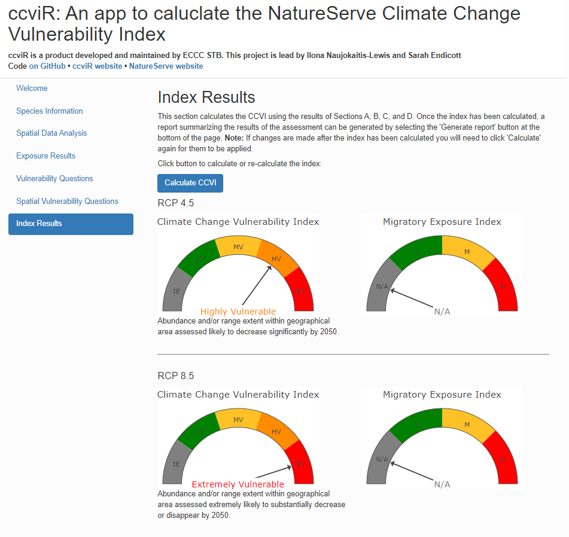

---
# Example from https://joss.readthedocs.io/en/latest/submitting.html
title: 'ccviR: an R package and Shiny app to calculate the NatureServe Climate Change Vulnerability Index'
tags:
  - R
  - climate change vulnerability
  - shiny
authors:
  - name: Sarah Endicott
    orcid: 0000-0001-9644-5343
    affiliation: 1
  - name: Ilona Naujokaitis-Lewis
    orcid: 0000-0001-9504-4484
    affiliation: 1
affiliations:
 - name: Landscape Science and Technology Division, National Wildlife Research Centre, Environment and Climate Change Canada, Ottawa, ON, Canada
   index: 1
citation_author: Endicott and Naujokaitis-Lewis
date: 20 May 2024
year: 2024
bibliography: paper.bib
output: rticles::joss_article
csl: apa.csl
journal: JOSS
---

# Summary

Climate change vulnerability assessments (CCVAs) are tools increasingly being adopted to determine relative indices of species vulnerability to the threat of climate change [@pacifici2015]. CCVAs can be spatially explicit bioclimatic distribution models, mechanistic models, aspatial trait-based assessments or a combination of these approaches [@foden2019; @pacifici2015]. CCVAs can be used to prioritize conservation actions and to inform extinction risk assessments by identifying the mechanisms and magnitude of impacts [@foden2019]. One popular trait-based CCVA tool is the [NatureServe Climate Change Vulnerability Index](https://www.natureserve.org/conservation-tools/climate-change-vulnerability-index) (CCVI), which is a rapid assessment tool designed to allow a relative grouping of unrelated taxa by vulnerability to climate change and to highlight which factors contribute to the climate change vulnerability of individual species or groups of taxa [@young2016; @young2015]. This information can then be used to inform conservation decision making and to help identify actions to increase species resilience to climate change.

The NatureServe CCVI algorithm combines several components that together determine a species vulnerability to climate change, including exposure to changes in temperature and moisture, indirect exposure to other changes brought on by climate change (e.g. sea level rise), and the species' traits that either make it sensitive to climate change or allow it to adapt to climate change (\autoref{fig:NS-alg}). In addition, it optionally incorporates the results of documented or modelled responses to climate change [@young2012; @young2016]. Exposure is assessed by determining the proportion of the species range that falls into 6 classes of temperature and moisture change, which is used to determine an exposure multiplier. Indirect exposure, sensitivity and adaptive capacity are assessed by scoring 23 vulnerability factors on a scale from ‘neutral’ (0) to ‘greatly increases vulnerability’ (3). Factors that cannot be answered can be left blank and contribute 0 to the total score, but if fewer than 13 are scored the index value cannot be calculated. The indirect exposure, sensitivity and adaptive capacity scores are then multiplied by the exposure multiplier and summed. An index value is then determined by applying a set of thresholds to the scores. If documented or modelled responses to climate change are included they are also scored on the scale from ‘neutral’ (0) to ‘greatly increases vulnerability’ and then summed to give a score for the section which is then converted to an index based on a threshold. The two index values are then combined using a table that gives more weight to the sensitivity and adaptive capacity section. The possible index values are Less Vulnerable, Moderately Vulnerable, Highly Vulnerable, Extremely Vulnerable or Insufficient Evidence if not enough factors of the CCVI are scored.

The NatureServe CCVI tool is available as an Excel workbook which users can fill-in based on spatial analysis, available research or expert opinion. While this Excel tool is easy to access and simple to use, it requires users to have the GIS skills needed to perform the spatial parts of the analysis and makes it difficult to reproduce this analysis. To address this concern and to expand the user friendliness of the NatureServe CCVI we have developed `ccviR`, an R package and Shiny app that implements the same vulnerability factors and scoring algorithm as the original CCVI in an easy to use Graphical User Interface (GUI) that caries out the spatial analysis internally (\autoref{fig:ccviR-app}). `ccviR` provides the same index values, scores and Monte Carlo uncertainty analysis as the NatureServe tool and adds several new features including performing spatial analyses within the app, calculating climate change exposure over multiple future climate scenarios, an additional Shiny app and functions to classify new climate data sets into exposure categories used by the index, and a range of visualizations to explain what factors are driving the vulnerability of a species. The ccviR Shiny app can be launched from an R session with one line of code and runs locally, allowing easy access to files. At any point the app can be saved with inputs stored in a human readable csv file which ensures comments and assessment values will not be lost even if a problem occurs with the R package. These csv files can also be used to compile data from multiple assessments for further analysis. In addition, to the csv and interactive results page a pdf report can be generated from the app to create a static version of the assessment. 

# Statement of need

The ``ccviR`` package and Shiny app make the NatureServe CCVI easier to calculate for a wide range of users. The inclusion of the spatial analysis components with in the package will allow conservation practitioners to focus on their areas of expertise while ensuring that analyses are consistent and reproducible across species. While the Shiny app increases user friendliness for a wide audience the `ccviR` package allows R users to more easily assess many species or perform sensitivity analyses. The R package framework also makes the CCVI more open with code and documentation available as well as unit tests to ensure the functionality of the tool. The inclusion of a Shiny app to allow users to create their own custom climate exposure data in `ccviR` extends the potential uses of the index to a greater geographic area and allows users to follow best practices of incorporating multiple future climate scenarios in their assessments. 

# Acknowledgements

The authors would like to acknowledge contributions from Adriana Caswell to the testing and development of this package.

# References
