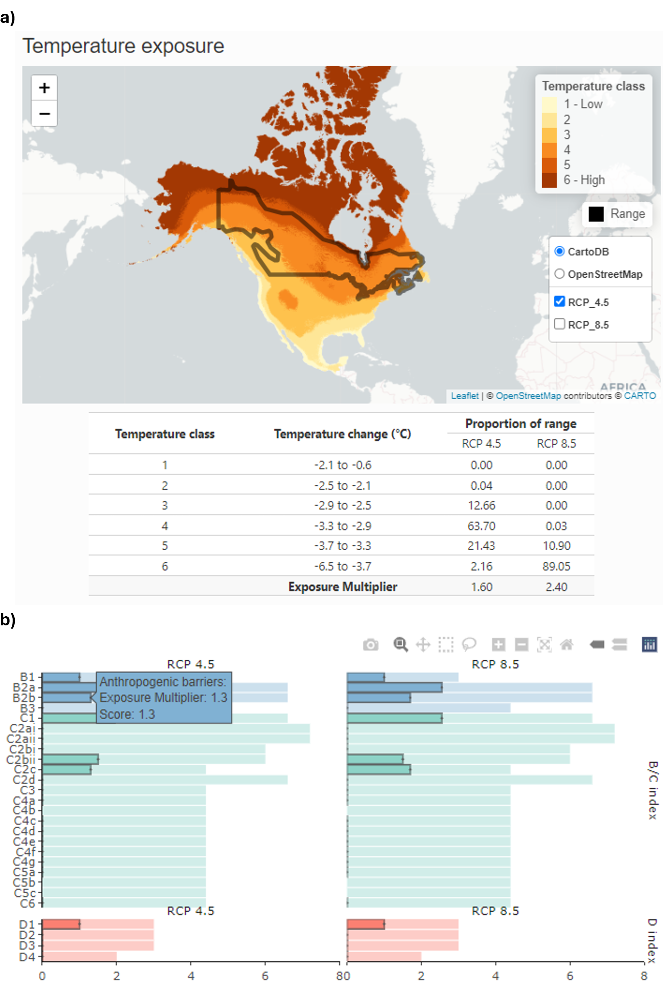

---
# Example from https://joss.readthedocs.io/en/latest/submitting.html
title: 'ccviR: an R package and Shiny app to implement the NatureServe Climate Change Vulnerability Index'
tags:
  - R
  - climate change vulnerability
  - shiny
authors:
  - name: Sarah Endicott
    orcid: 0000-0001-9644-5343
    affiliation: 1
  - name: Ilona Naujokaitis-Lewis
    orcid: 0000-0001-9504-4484
    affiliation: 1
affiliations:
 - name: Landscape Science and Technology Division, National Wildlife Research Centre, Environment and Climate Change Canada, Ottawa, ON, Canada
   index: 1
citation_author: Endicott and Naujokaitis-Lewis
date: 20 May 2024
year: 2024
bibliography: paper.bib
output: rticles::joss_article
csl: apa.csl
journal: JOSS
---

# Summary

Climate change vulnerability assessments (CCVAs) are tools increasingly adopted to rank species' vulnerability to the threat of climate change [@pacifici2015]. Common CCVA approaches include trait-based, correlative models (e.g. species distribution models), mechanistic models (e.g. mechanistic niche models), or a combination of these approaches [@foden2019; @pacifici2015]. CCVAs can be used to inform extinction risk assessments by identifying the mechanisms and magnitude of impacts [@foden2019]. One popular trait-based CCVA tool is the [NatureServe Climate Change Vulnerability Index](https://www.natureserve.org/conservation-tools/climate-change-vulnerability-index) (CCVI), which is a rapid assessment tool that ranks species' vulnerability to climate change and highlights factors contributing to increased vulnerability[@young2016; @young2015]. Outputs of the NatureServe CCVI can inform conservation decisions and identify actions to increase species' resilience to climate change.

The NatureServe CCVI combines several components that contribute to a species' vulnerability to climate change, including exposure to changes in temperature and moisture (Section A), indirect exposure to other changes brought on by climate change (e.g. sea level rise; Section B), and traits related to species' sensitivity or ability to adapt to climate change (Section C; \autoref{fig:NS-alg}). It also optionally incorporates the results of documented or modeled responses to climate change [Section D\; @young2012; @young2016]. The resulting CCVI ranks include: 'Less Vulnerable', 'Moderately Vulnerable', 'Highly Vulnerable', 'Extremely Vulnerable' or 'Insufficient Evidence'. Exposure is assessed by determining the proportion of the species' range that falls into six classes of temperature and moisture change, which is used to assign an exposure multiplier. Sections B, C and optionally D are each scored on a scale from ‘neutral’ (score: 0) to ‘greatly increases vulnerability’ (score: 3). The indirect exposure, sensitivity and adaptive capacity scores are multiplied by the exposure multiplier and summed. The final CCVI rank is a result of combining all scores through a variety of operations including weighting sensitivity and adpative capacity scores. [comment: i think in the process of reducing the following text, a lot is lost that affects comprehension, Consider deleting the following sentences and replacinng with my suggestions, above ] Where applicable the score is multiplied by an exposure multiplier and then scores are summed separately for Sections B and C and Section D. Thresholds are applied to these scores to determine an index value and then the two index values are combined into a final index value (i.e., rank) using a table that gives more weight to the sensitivity and adaptive capacity sections (\autoref{fig:NS-alg}).

The NatureServe CCVI tool is an Excel workbook that users complete using available scientific information, expert opinion, and spatial analyses. While the tool is straightforward to use, it requires users to possess technical Geographical Information System (GIS) skills and access to (proprietary) software to perform the spatial analyses. This challenges the implementation of reproducible analyses, which are increasingly required for credible scientific processes [@munafò2017]. In addition, the Excel-based version requires repeated assessments to assess uncertainty associated with choice of Global Climate Models or emission scenarios.

To improve accessibility and reproducibility of the NatureServe CCVI we developed `ccviR`, an R package and Shiny app that implements the original CCVI in an easy to use Graphical User Interface (GUI). `ccviR` applies the original scoring algorithm to assess vulnerability and includes the original Monte Carlo uncertainty analysis. A major advance of `ccviR` is the functionality to perform spatial analyses internally, using R, such that GIS skills and costly software are not required. Users are only required to specify the locations of spatial data files on their computer, using the Shiny app or R code, and `ccviR` automates all spatial analyses. Examples of these automated spatial processes include overlays of the species' range with exposure categories, historical climate regime, and modeled changes in the species' range. [Comment: this sentence could be deleted as it is saying the same thing as the sentence next paragraph mentioning veriffying spatial analyses. Tho, i do like how this sentence is written: The `ccviR` Shiny app presents the results of the spatial analyses using interactive maps, that allow for user-directed validation of the spatial analyses and opportunities to modify the resulting factor scores, if desired.] Another significant addition is a second Shiny app that allows users to classify independently-supplied climate data sets into the exposure categories used by the index based on the median and half the interquartile range. This makes the methods used to determine exposure classes explicit and repeatable for different climate data sets or different regions. [Comment: i have add these 2 sentences to the previous paragraph, as they flow with the subject of the paragraph whic is introducing novel ccviR things:] Additional novel features of `ccviR` include functionality to assess the consequences of uncertainty associated with choice of emission scenarios and/or global circulation models on CCVI outcomes. Additional enhancements include multiple interactive visualizations used to 1) verify spatial analyses and 2) explain what factors are driving the vulnerability of a species (\autoref{fig:ccviR-app}). 

The `ccviR` Shiny app can be launched from an R session with one line of code and runs locally, allowing easy access to files. While using the app, assessments can be saved to a csv file at any point, then the csv file can be used to restart the app and continue the assessment. The human readable csv format ensures that comments and assessment values can be used independent of the `ccviR` package which facilitates transparent and reproducible assessments. These csv files can also be used to compile data from multiple assessments for further analysis and synthesis. `ccviR` facilitates communication of scientific outcomes by including functionality to generate a pdf report summarizing the assessment.

# Statement of need

The `ccviR` R package and Shiny app facilitates a seamless, accessible, and reproducible version of the NatureServe CCVI, that ensures an enhanced and intuitive user experience. The inclusion of the spatial analysis components within the package removes the need for technical GIS-based skills to perform CCVI assessments and allows conservation practitioners to focus on their areas of expertise. Simultaneously, 'ccviR' ensures that analyses are consistent and reproducible across species. While the Shiny app increases user friendliness for a wide audience, the `ccviR` package allows more proficient R users to customize their analysis workflow and more easily assess many species or perform sensitivity analyses to assess the consequences of multiple forms of uncertainty. The R package framework ensures the CCVI more open with code and documentation available as well as unit tests to ensure the functionality of the tool. The inclusion of a Shiny app to allow users to create their own custom climate exposure data in `ccviR` extends the potential uses of the index to a greater geographic area and allows users to follow best practices of incorporating multiple future climate models and emission scenarios in their assessments.

# Acknowledgements

The authors acknowledge Adriana Caswell for assistance with development and testing of this package and Bruce Young for help with understanding the NatureServe CCVI algorithm.

# References
