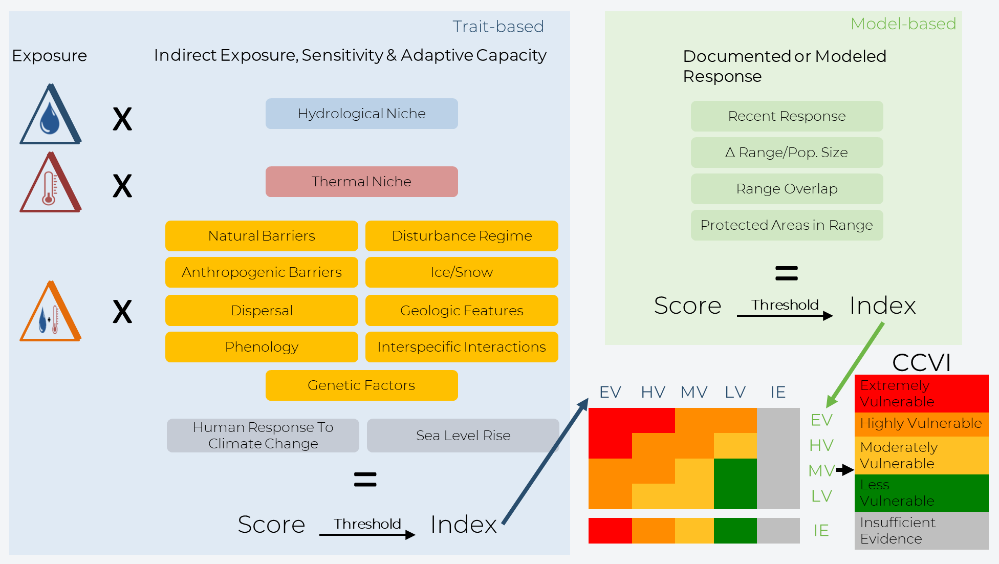
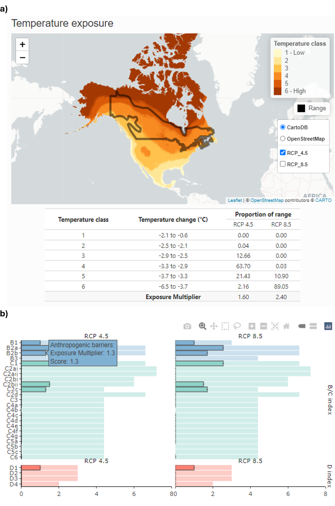

---
# Example from https://joss.readthedocs.io/en/latest/submitting.html
title: 'ccviR: an R package and Shiny app to implement the NatureServe Climate Change Vulnerability Index'
tags:
  - R
  - climate change vulnerability
  - shiny
authors:
  - name: Sarah Endicott
    orcid: 0000-0001-9644-5343
    affiliation: 1
  - name: Ilona Naujokaitis-Lewis
    orcid: 0000-0001-9504-4484
    affiliation: 1
affiliations:
 - name: Landscape Science and Technology Division, National Wildlife Research Centre, Environment and Climate Change Canada, Ottawa, ON, Canada
   index: 1
citation_author: Endicott and Naujokaitis-Lewis
date: 20 May 2024
year: 2024
bibliography: paper.bib
output: rticles::joss_article
csl: apa.csl
journal: JOSS
---

# Summary

Climate change vulnerability assessments (CCVAs) are tools increasingly adopted to rank species' vulnerability to the threat of climate change [@pacifici2015]. Common CCVA approaches include trait-based, correlative models (e.g. species distribution models), mechanistic models (e.g. mechanistic niche models), or a combination of these approaches [@foden2019; @pacifici2015]. CCVAs can be used to inform extinction risk assessments by identifying the mechanisms and magnitude of impacts [@foden2019]. One popular trait-based CCVA tool is the [NatureServe Climate Change Vulnerability Index](https://www.natureserve.org/conservation-tools/climate-change-vulnerability-index) (CCVI), which is a rapid assessment tool designed to rank species' vulnerability to climate change and to highlight which factors contribute to the climate change vulnerability of individual species or groups of taxa [@young2016; @young2015]. This information can inform conservation decision making and identify actions to increase species' resilience to climate change.

The NatureServe CCVI algorithm combines several components that contribute to a species' vulnerability to climate change, including exposure to changes in temperature and moisture (Section A), indirect exposure to other changes brought on by climate change (e.g. sea level rise; Section B), and the species' traits that either make it sensitive to climate change or allow it to adapt to climate change (Section C; \autoref{fig:NS-alg}). In addition, it optionally incorporates the results of documented or modeled responses to climate change [Section D\; @young2012; @young2016]. The resulting CCVI can have one of five index values, 'Less Vulnerable', 'Moderately Vulnerable', 'Highly Vulnerable', 'Extremely Vulnerable' or 'Insufficient Evidence'. Exposure is assessed by determining the proportion of the species' range that falls into 6 classes of temperature and moisture change, which is used to determine an exposure multiplier. Indirect exposure, sensitivity and adaptive capacity (Sections B and C), are assessed by scoring 23 vulnerability factors on a scale from ‘neutral’ (score: 0) to ‘greatly increases vulnerability’ (score: 3). Factors that cannot be scored can be left blank and do not contribute to the total score, but if fewer than 13 factors are scored the final index value will be returned as 'Insufficient Evidence'. The indirect exposure, sensitivity and adaptive capacity scores are then multiplied by the exposure multiplier and summed giving a total score. An index value for Sections A-C is then determined by applying a set of thresholds to the total score. If documented or modeled responses to climate change are included they are also scored on the scale from ‘neutral’ (score: 0) to ‘greatly increases vulnerability’ (score: 3) and then summed to give a score for Section D, which is then converted to an index value based on a threshold. The index values for Sections A-C and Section D are then combined into a final index value using a table that gives more weight to the sensitivity and adaptive capacity sections (\autoref{fig:NS-alg}).

The NatureServe CCVI tool is available as an Excel workbook that users can fill in based on (a priori) spatial analyses, available research or expert opinion. While this Excel tool is easy to access and straightforward to use, it requires users to possess technical Geographical Information System (GIS) skills and software, that is often proprietary, to perform the spatial components of the analysis. This challenges the implementation of reproducible analyses, which are increasingly required for credible scientific processes [@munafò2017]. In addition, the Excel-based version requires repeated assessments to determine the effects of uncertainty associated with choice of Global Climate Models (GCMs) or emission scenarios.

To improve accessibility and reproducibility of the NatureServe CCVI we have developed `ccviR`, an R package and Shiny app that implements the original CCVI in an easy to use Graphical User Interface (GUI). `ccviR` applies the original scoring algorithm to assess vulnerability and includes the Monte Carlo uncertainty analysis as in the Excel-based tool. A major advance of `ccviR` is the functionality to perform spatial analyses internally, using R, such that GIS skills and software are not required. To perform spatial analyses users are only required to specify the locations of spatial data files on their computer, using the Shiny app or R code, and `ccviR` automates subsequent analyses. Examples of these automated spatial processes include overlays of the species' range with: exposure categories, historical climate regime, and modeled changes in the species' range. The `ccviR` Shiny app presents the results of the spatial analyses using interactive maps, that allow for user-directed validation of the spatial analyses and opportunities to modify the resulting factor scores, if desired. Another significant addition is a second Shiny app that allows users to classify new independently-supplied climate data sets into the exposure categories used by the index based on the median and half the interquartile range. This makes the methods used to determine exposure classes explicit and repeatable for different climate data sets or different regions. Users must keep in mind that, since the CCVI is a relative index, index values should only be compared across species assessed using the same climate data.

Additional novel features of `ccviR` include functionality to incorporate multiple sources of uncertainty into CCVI assessments. Specifically, 'ccviR' allows users to assess the consequences of uncertainty associated with choice of emission scenarios and/or global circulation models on CCVI outcomes. Additional enhancements include multiple interactive visualizations used to 1) verify spatial analyses and 2) explain what factors are driving the vulnerability of a species (\autoref{fig:ccviR-app}). The `ccviR` Shiny app can be launched from an R session with one line of code and runs locally, allowing easy access to files. While using the app, assessments can be saved to a csv file at any point, then the csv file can be used to restart the app and continue the assessment. The human readable csv format ensures that comments and assessment values can be used independent of the `ccviR` package which facilitates transparent and reproducible assessments. These csv files can also be used to compile data from multiple assessments for further analysis and synthesis. `ccviR` facilitates communication of scientific outcomes by including functionality to generate a pdf report reflecting a static version of the assessment.

# Statement of need

The `ccviR` R package and Shiny app facilitates a seamless, accessible, and reproducible version of the NatureServe CCVI, that ensures an enhanced and intuitive user experience. The inclusion of the spatial analysis components within the package removes the need for technical GIS-based skills to perform CCVI assessments and allows conservation practitioners to focus on their areas of expertise. Simultaneously, 'ccviR' ensures that analyses are consistent and reproducible across species. While the Shiny app increases user friendliness for a wide audience, the `ccviR` package allows more proficient R users to customize their analysis workflow and more easily assess many species or perform sensitivity analyses. The R package framework also makes the CCVI more open with code and documentation available as well as unit tests to ensure the functionality of the tool. The inclusion of a Shiny app to allow users to create their own custom climate exposure data in `ccviR` extends the potential uses of the index to a greater geographic area and allows users to follow best practices of incorporating multiple future climate scenarios in their assessments.

# Acknowledgements

The authors would like to acknowledge contributions from Adriana Caswell to the testing and development of this package and conversations with Bruce Young that helped us to understand the NatureServe CCVI algorithm.

# References
