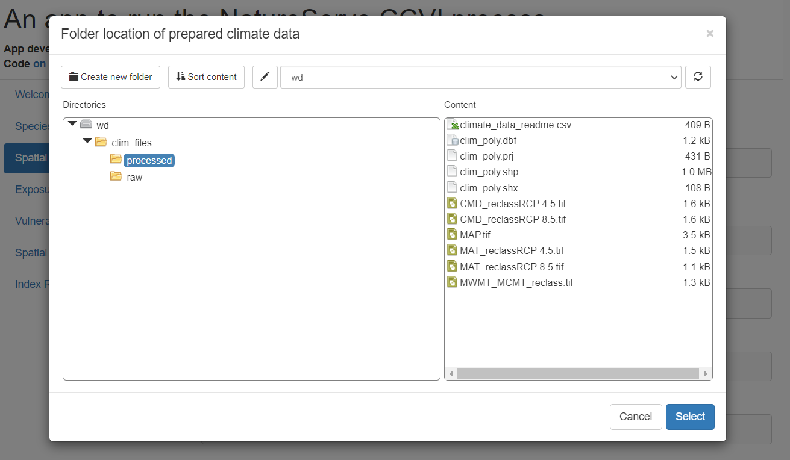
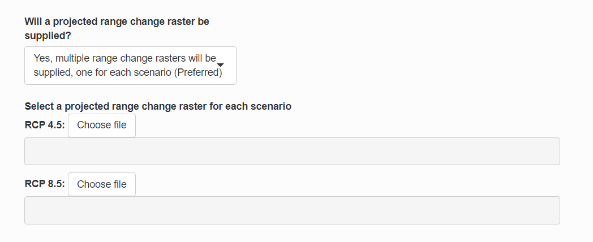
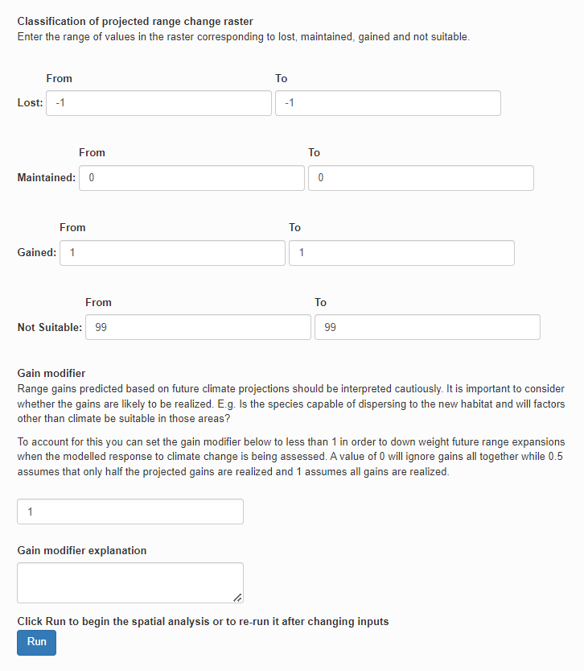
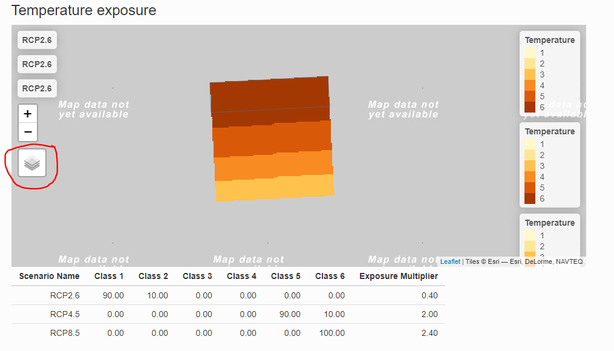
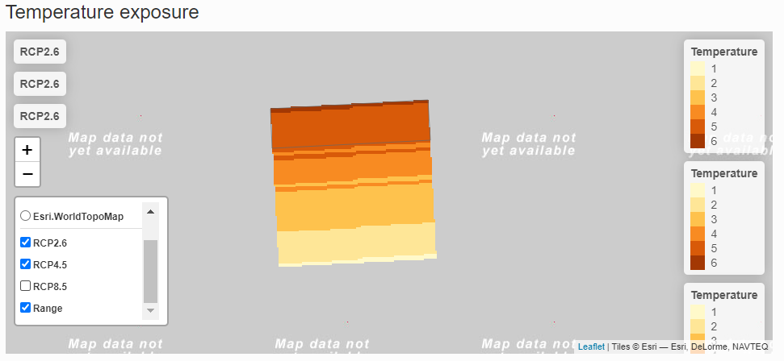
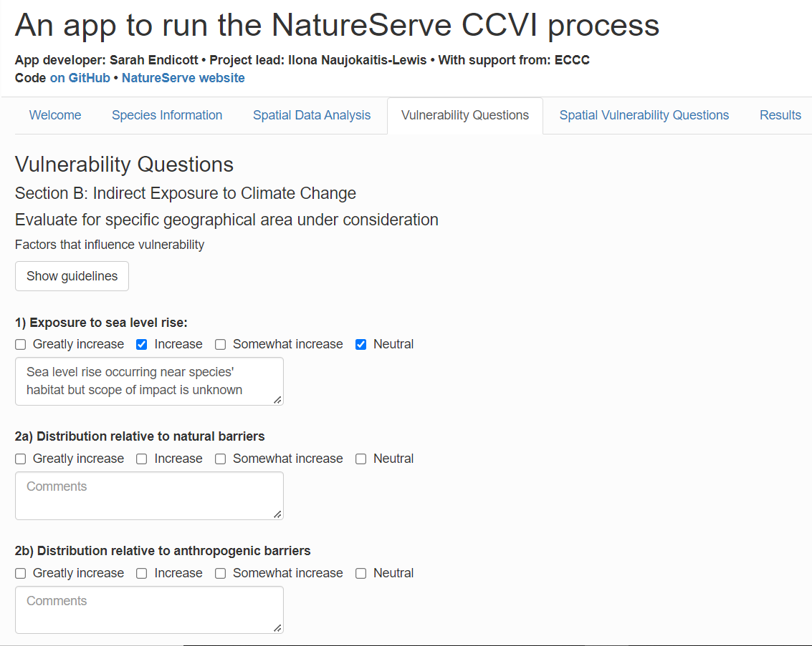

```{r, include = FALSE}
knitr::opts_chunk$set(
  collapse = TRUE,
  comment = "#>"
)
```
## Introduction
The ccviR app implements the [NatureServe Climate Change Vulnerability Index (CCVI)](https://www.natureserve.org/conservation-tools/climate-change-vulnerability-index) in a Shiny App. The app allows all of the geospatial aspects of calculating the CCVI to be done in R, removing the need for separate GIS calculations. It also includes new features and enhanced user friendliness to make it easier to calculate the index and explore the results. 

The NatureServe CCVI is a trait based climate change vulnerability assessment framework that can also include observed and modeled responses to climate change. The NatureServe CCVI includes three commonly used components of vulnerability: exposure, sensitivity and adaptive capacity and optionally incorporates the results of documented or modeled responses to climate change. Exposure is assessed by determining the proportion of the species range that falls into 6 classes of temperature and moisture change, which is used to determine an exposure multiplier. Sensitivity and adaptive capacity and responses to climate change are assessed by scoring vulnerability factors (23 and 4 respectively), on a scale from ‘neutral’ (0)  to ‘greatly increases vulnerability’ (3). Factors that cannot be answered can be left blank and contribute 0 to the total score, but if fewer than 13 are scored the index value can not be calculated. The sensitivity and adaptive capacity section scores are then multiplied by an exposure multiplier and summed, while the scores for the response to climate change section are simply summed. An index value is then determined for each section by applying a set of thresholds to the scores. The two index values are then combined using a table that gives more weight to the sensitivity and adaptive capacity section. The possible index values are Less Vulnerable, Moderately Vulnerable, Highly Vulnerable, Extremely Vulnerable or Insufficient Evidence if not enough factors of the CCVI are scored. For more detailed information on how the index works and how each factor is scored see the [NatureServe CCVI Guidelines](https://www.natureserve.org/sites/default/files/guidelines_natureserveclimatechangevulnerabilityindex_r3.02_1_jun_2016.pdf) and the references below.

## Launching the app
The app is launched by calling the `run_ccvi_app()` function, which will launch the app in the user's default internet browser. All file selection windows will start in the current working directory. To run the app with data stored in a different folder you can call `run_ccvi_app()` with the folder path as the first argument. For example if all of the data is stored in a subdirectory named "data" of the RStudio project where I am calling the function I would call `run_ccvi_app("data")` to avoid having to open the data folder every time I select a file. Alternatively, the complete path to the data folder can be supplied e.g. "C:/Users/username/Documents/path/to/folder" (Note that paths in R must be supplied using forward slashes). 

## Run a demonstration
Before using the app to assess a real species we recommend walking through the app with the demo data set provided. Run the code below to get started.

```{r setup, eval=FALSE}
library(ccviR)
run_ccvi_app("demo")
```

### Getting started
The Welcome Tab provides information on the Index and the data needed to calculate it.

For the demonstration species all the required data is included in the package, but for a real species you will need download a prepared set of climate data or create your own (see `vignette("data_prep_vignette", package = "ccviR")`) and think about and acquire the data described in Steps 1 and 2 on the Welcome page but for the demonstration we can go ahead and press "Start" to begin calculating the index.

### Species information
On this page you will provide some basic details about the species. Make sure to select the appropriate taxonomic group since some aspects of the index are conditional on this. For the demonstration select "Bird". See the NatureServe Guidelines to better understand the meaning of the two check boxes at the end. For the demonstration check the box for migratory species. Click "Next".

### Spatial data analysis
On this tab you will load the spatial data used by the index and see the results of the spatial analysis for exposure to climate change. The prepared climate data can be found under "clim_files > processed > multi_scenario".

{width=100%}
Then select the range polygon for the species by selecting the file "rng_poly_high.shp". Select the assessment area by selecting the "assess_poly.shp" file. Select the "nonbreed_poly.shp" for the non-breeding range. Select "PTN_poly.shp" for the physiological thermal niche. And finally, select for the projected range change raster hold Ctrl and click "HS_rast_RCP2.6", "HS_rast_RCP4.5", and "HS_rast_RCP8.5". If range change rasters are not available for each scenario a single raster can be used.

{width=100%}

New inputs will show up to specify how the raster should be classified into lost, gained, maintained or not suitable. For the example use the default values, which are for a raster where lost is 1, maintained in 2-6,  gained is 7 and 0 is not suitable. Note if you wanted to ignore gains you could set the gain multiplier to 0 but we will leave it at 1 and assume that the model has already accounted for whether habitat gains are likely to be realized. 

{width=100%}

Then click "Run". A loading symbol will appear while the data is being processed. Then interactive maps of climate change exposure will be displayed. The real climate data will cover all of North America. The exposure maps are classified into 6 classes and the proportion of the species range in each class is displayed in the table. The exposure multiplier is determined by the level of exposure and is used to modify the sensitivity and adaptive capacity components of the index based on exposure to climate change. To view the map for different scenarios click the layer symbol and toggle each layer on or off. 

{width=100%}

{width=100%}

The non-breeding range of the species is used to determine the migratory exposure index based on the climate change exposure index (CCEI). The CCEI is a metric of climate change exposure that indicates the level of exposure to both temperature and moisture change using the Euclidean distance, see the NatureServe guidelines for a full description. 

Once you have finished exploring the maps click "Next".

### Vulnerability questions
Vulnerability questions are detailed questions that the index uses to score the species' indirect exposure, sensitivity, adaptive capacity and modeled or documented responses to climate change. Descriptions of how to interpret and score the questions are available in the NatureServe guidelines which are included as a pop-up if you click the "Show guidelines" button. 

{width=100%}

Some vulnerability questions are answered based on an analysis of spatial data and these questions are dealt with on the next tab. For the demonstration you can select any check box that you want for each question, try a few different versions and see how it affects the result! There are three sections, 'Section B: Indirect Exposure to Climate Change' and 'Section C: Sensitivity and Adaptive Capacity' Questions that are unknown can be left blank.  Click "Next" to go to the next tab

### Spatial Vulnerability Questions
This tab includes the vulnerability questions that have a spatial component. Each question includes a map and table showing how the data has been summarized. The check box is pre-selected based on the spatial data analysis but can be changed if needed. Note that if the check box is changed and then the Run button on the Spatial Analysis page is clicked again you will see a warning that the value of the check boxes on this page will be updated to the value based on the re-run spatial analysis. The comments will not be affected though so you can explain the reason for any adjustments in the comments and then remake those adjustments if they are still applicable. 
For the demonstration leave the check boxes as they are and then click "Next". 

### Results

On the Results page click Calculate to calculate the index value. Once loaded this page gives the resulting index value and tables and graphs that explain how the index value was determined. These are explained in the app. Once you are finished with reviewing the results you can save the data as a csv file.

If you go back and change the answer to a vulnerability question you will need to click the Calculate button again to see the updated results. 

### Saving the app
The state of the app can be saved by clicking the save button at the bottom of the Results page. A pop up will appear that asks you to pick a location and name for a folder that will store the app data. Be sure to save this some where that is easy to remember because you will need to find it again to load the saved app. The folder name must have only letters or numbers and no spaces. This will create a folder with the given name containing two .rds files that store the values.

This will save the information entered into the app but it will not save the results so when the app is loaded from the saved file it will re-run the calculations. In addition, only the path to the spatial data is stored not the data itself so the app will not be able to load if data is moved or its name is changed. If the data has moved you will get an error message but you can go back to the Spatial Analysis tab and select the new file location and then press Run which will re-run the spatial analysis but keep the answers to the non-spatial vulnerability questions from the saved file. 

## Troubleshooting

If you have a problem in the app you can look at the output in the R console for a clue about what is going wrong. The output will include messages, warnings and any error messages that are produced. You can ignore warnings unless something else has gone wrong. Most errors will show in the app but in some situations the app will go grey and the error message can be found in the R console. 

If you have persistent problems with the app you can do the same analysis using the ccviR package. You will often be able to figure out what is causing the problem and return to the app. See `vignette("package_vignette", package = "ccviR")` for a tutorial on how to use the package.  

## References
Young, B. E., K. R. Hall, E. Byers, K. Gravuer, G. Hammerson, A. Redder, and K. Szabo. 2012. Rapid assessment of plant and animal vulnerability to climate change. Pages 129-150 in Wildlife Conservation in a Changing Climate, edited by J. Brodie, E. Post, and D. Doak. University of Chicago Press, Chicago, IL. https://doi.org/10.7208/9780226074641-007

Young, B. E., N. S. Dubois, and E. L. Rowland. 2015. Using the Climate Change Vulnerability Index to inform adaptation planning: lessons, innovations, and next steps. Wildlife Society Bulletin 39:174-181.


