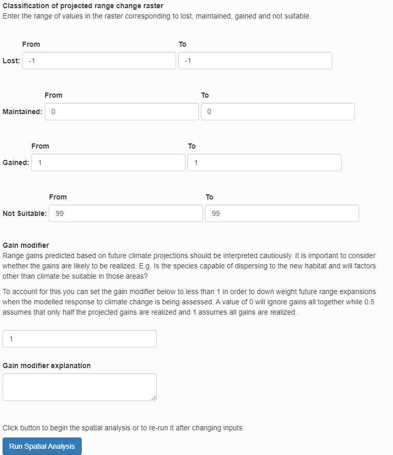
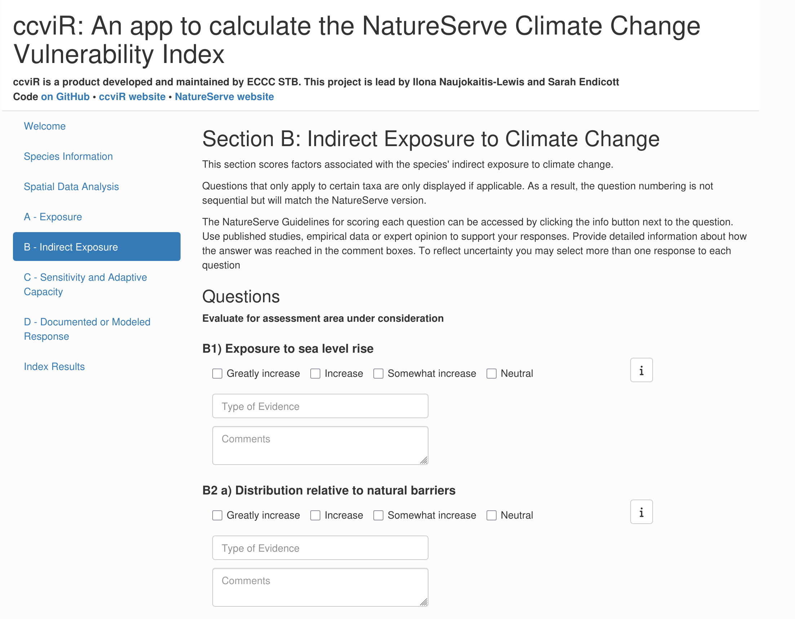
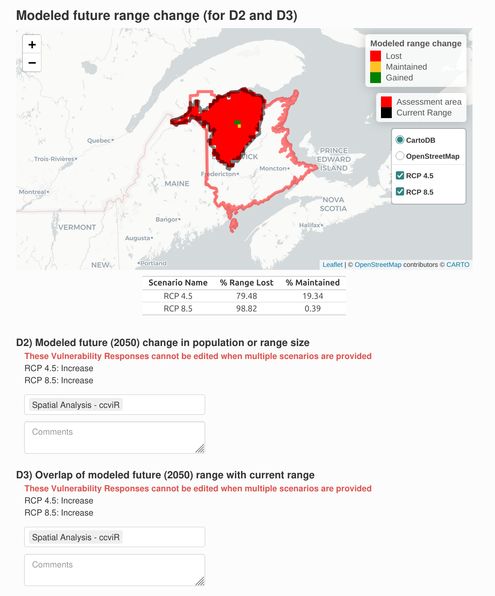
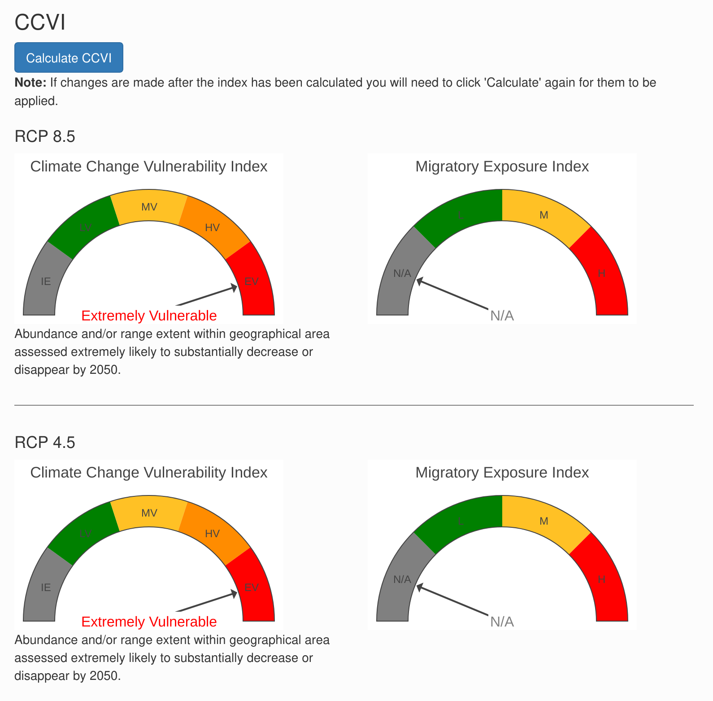

```{r, include = FALSE}
knitr::opts_chunk$set(
  collapse = TRUE,
  comment = "#>"
)
```

```{r setup}
library(ccviR)
```

# Introduction

## What is the ccviR app?

The ccviR R package and Shiny app was developed by Environment and Climate Change Canada (ECCC) to implement the [NatureServe Climate Change Vulnerability Index (CCVI) version 3.02](https://www.natureserve.org/sites/default/files/guidelines_natureserveclimatechangevulnerabilityindex_r3.02_1_jun_2016.pdf) [@young2016; @endicott2024]. It is designed to assist land managers to rapidly assess the relative climate change vulnerability of terrestrial and aquatic plant and animal species, as well as lichens across North America [@endicott2024]. The package allows all of the geospatial aspects of calculating the CCVI to be done in R, removing the need for separate GIS calculations. The app provides an interactive application designed to offer a user-friendly and simple interface for calculating the NatureServe CCVI.

The NatureServe CCVI is a rapid assessment tool designed to allow a relative grouping of unrelated taxa by vulnerability to climate change and to highlight which factors contribute to the climate change vulnerability of individual species or groups of taxa. Outputs of the NatureServe CCVI can inform conservation decisions and identify actions to increase species' resilience to climate change. See [Young et. al (2012)](https://www.degruyter.com/document/doi/10.7208/9780226074641-007/html), [Young et. al. (2015)](https://doi.org/10.1002/wsb.478) and the [NatureServe CCVI Guidelines](https://www.natureserve.org/sites/default/files/guidelines_natureserveclimatechangevulnerabilityindex_r3.02_1_jun_2016.pdf) for more detailed descriptions of the index and how it was created.

Like the NatureServe CCVI, the ccviR is designed to assess the climate change vulnerability of terrestrial and aquatic plants, animals (including migratory species), and lichens, within a defined geographic area of the USA and Canada (i.e., North America). The index contemplates vulnerability based on the projected change in climate from a baseline of 1961-1990 to the year 2050.

The NatureServe CCVI combines several components that contribute to a species' vulnerability to climate change, including exposure to changes in temperature and moisture (Section A), indirect exposure to other changes brought on by climate change (e.g. sea level rise; Section B), and traits related to species' sensitivity or ability to adapt to climate change (Section C; \autoref{fig:NS-alg}). It also optionally incorporates the results of documented or modeled responses to climate change [Section D; @young2012; @young2016]. The resulting CCVI ranks include: 'Less Vulnerable', 'Moderately Vulnerable', 'Highly Vulnerable', 'Extremely Vulnerable' or 'Insufficient Evidence'. Exposure is assessed by determining the proportion of the species' range that falls into six classes of temperature and moisture change, which is used to assign an exposure multiplier. The vulnerability factors in Sections B, C and optionally D are each scored on a scale from ‘neutral’ (score: 0) to ‘greatly increases vulnerability’ (score: 3). The indirect exposure, sensitivity and adaptive capacity scores are multiplied by the exposure multiplier and summed. The final CCVI value is a result of applying thresholds to the total scores and balancing the sensitivity and adaptive capacity rank with the documented or modeled response rank (\autoref{fig:NS-alg}). See section X for a more detailed explanation of the scoring algorithm.


The ccviR application is run locally on the users own computer and is not currently hosted online. Results can be saved as a csv file and a pdf report can be generated to summarise the results.

While the CCVI is a rapid assessment tool this is relative to other climate change vulnerability assessments and there will still be a significant amount of time required to source information about species, gather evidence to answer indirect exposure, sensitivity and adaptive capacity questions and validate the results of the assessment.

## Benefits compared to NatureServe’s CCVI:

The ccviR uses the same questions and scoring as the NatureServe Climate Change Vulnerability Index 3.02, but offers at several improvements:

-   Spatial analyses are performed by the app so only minimal GIS skills are needed

-   Simultaneously calculates the index for multiple scenarios such as, emissions scenarios, time horizons or GCMs

-   Outputs include interactive maps and graphs that explain the drivers of the index value

-   Generates a report to communicate the results of the assessment

-   Includes a second Shiny app to classify new climate data sets into exposure categories

## What can it be used for?

The outputs of the index are designed to support stewards and scientists to assess the relative vulnerability of species to climate change in a defined area, called the assessment area. This area should be chosen to reflect the scale at which the results of the assessment will be applied. Results for multiple species can be compared directly as long as the same assessment area and climate data are used in all the assessments.

According to Young et al., (2016), the outputs can be used to:

-   Determine which species are most vulnerable to climate change within the assessment area.

-   Identify common drivers of vulnerability for species in an area.

-   Standardise assessment, improve communication, and facilitate coordination of climate change action across jurisdictional boundaries.

-   Help prioritise management actions for species (when combined with other ecological, social and economic factors of importance to planning, such as species status, recoverability, and cost).

-   Identify where refugia may exist for planning and protection.

-   Identify where information gaps are impeding assessment and management of species relevant to climate change vulnerability and management to help prioritise subsequent research efforts.

In addition, the results of the CCVI can be used to help inform risk assessments and recovery planning for species. While the scoring criteria and thresholds do not directly link to other assessment frameworks (e.g. the IUCN-CMP threat classification system), the information gathered for the CCVI assessment and presented in the results can be applied and re-interpreted to inform other assessments. See Section X for a detailed explanation of how the ccviR outputs can inform COSEWIC Status Reports and the creation of Recovery Strategies.

## Known limitations

-   Not for use outside of North America.

-   Assumes a temporal scale to 2050.

-   Not applicable to marine species.

-   Does not provide probabilistic information on species decline but rather a relative rank.

# Information you need to get started

The ccviR requires assessors to provide spatial information and a series of judgements to inform questions about exposure, sensitivity and adaptive capacity. In this section we outline some key requirements and minimum information needs. More information on these factors and the rationale for their consideration is provided in the [NatureServe CCVI Guidelines](https://www.natureserve.org/sites/default/files/guidelines_natureserveclimatechangevulnerabilityindex_r3.02_1_jun_2016.pdf) [@young2016].

## Installing R

The ccviR Application is launched from an open source software application called R. You will need to [download R and optionally RStudio](https://rstudio-education.github.io/hopr/starting.html) to use the app. Instructions to launch the app are shown below. Users do not need to know how to code in R, however, familiarity with R can be helpful.

## Spatial data

Below are the required and optional data layers for a ccviR analysis. Appendix A provides information on sourcing species ranges, assessment area polygons, and climate data. It also provides definitions of some common GIS concepts. The ccviR assumes that users have an introductory level of knowledge and experience relevant to reviewing spatial data. If this is not the case, then we recommend finding someone who has some GIS experience to help find, review, and upload data layers for your first analysis. All polygon data should be provided as a shapefile while raster data can be in any common raster format but ".tif" files are recommended.

**Required** spatial datasets are as follows (Refer to Appendix A for additional information):

-   [Climate data (required):]{.underline} Climate data has already been prepared for use in the ccviR. You will need to [download the data](https://drive.google.com/file/d/1hAVMW5VBDOVHhMItm7U-whsqPgb6bn5C/view?usp=drive_link) and unzip it to use it in the app. The prepared data uses the 1961-1990 normal period for historical data and the 2050s timeframe and the RCP 4.5 and RCP 8.5 scenarios for future projections. The climate data should be the same of all species assessed, so you will only need to download it once even for multiple assessments. See ["Preparing Custom Climate Data"](https://landscitech.github.io/ccviR/articles/data_prep_vignette.html) for how to use a different climate data set.

-   [Species North American or global range polygon (required):]{.underline} Ideally this is the complete area occupied by the species in North America including areas outside the assessment area.

-   [Assessment area polygon (required):]{.underline} The management area within North America for which the species vulnerability is being assessed. For example, a country, province, state, or protected area.

**Optional** species-specific spatial datasets that are useful for specific analyses:

-   [Physiological thermal niche (PTN) polygon (Optional]{.underline}): The PTN polygon should include cool or cold environments occupied by the species that may be lost or reduced in the assessment area because of climate change. This could include species restricted to frost pockets, north-facing slopes, shady ravines, or alpine areas if these are among the coldest habitats in the assessment area so the species is unlikely to be able to shift within the assessment area if these cool areas are lost. If spatial data for the PTN is not available the question can be answered manually or left as unknown. It is rare to have spatial data for the physiological thermal niche so it should be filled in manually in most cases.

-   [Non-breeding range polygon (Optional):]{.underline} For migratory species provide a polygon of the species' range in the non-breeding season.

-   [Projected range change raster (Optional):]{.underline} The modeled change in the species range caused by climate change. The values of the raster cells should indicate whether the cell was lost, maintained, gained or was never included in the range. This dataset is used in the modeled response analysis to determine the proportion of habitat that will be lost, maintained, or gained within the assessment area.

-   [Protected area polygon (Optional):]{.underline} Polygon data for all protected areas in Canada and the United States has already been prepared for use in the ccviR. You will need to [download the data](https://drive.google.com/file/d/1fXdei_tTgBX0SeWpJafMPnSTQS101ST9/view?usp=drive_link) and unzip it to use it in the app.

## Vulnerability information

Assessors are required to provide estimates for at least 13 factors in the vulnerability assessment section (Table \@ref(tab:c-b-questions)). This must include information on at least:

-   3 factors in Section B, and

-   10 factors in Section C.

Additional questions related to documented or modeled response (Section D) are optional (Table \@ref(tab:d-questions)).

To better understand the information required refer to the [NatureServe CCVI Guidelines](https://www.natureserve.org/sites/default/files/guidelines_natureserveclimatechangevulnerabilityindex_r3.02_1_jun_2016.pdf) [@young2016].

+-------------+-----------------------------------------------------------------------------------+----------------------------------+----------------------------------------+
| Question ID | Parameter                                                                         | Response categories[[1]](#_ftn1) | Exposure Modifier applied[[2]](#_ftn2) |
+=============+===================================================================================+==================================+========================================+
| B1          | Proportion of range lost to sea level rise                                        | GI, I, SI, N                     | Climate                                |
+-------------+-----------------------------------------------------------------------------------+----------------------------------+----------------------------------------+
| B2          | Natural barriers                                                                  | GI, I, SI, N                     | Climate                                |
+-------------+-----------------------------------------------------------------------------------+----------------------------------+----------------------------------------+
| B2          | Anthropogenic barriers                                                            | GI, I, SI, N                     | Climate                                |
+-------------+-----------------------------------------------------------------------------------+----------------------------------+----------------------------------------+
| B3          | Land use changes resulting from human responses to climate change                 | I, SI, N                         | Climate                                |
+-------------+-----------------------------------------------------------------------------------+----------------------------------+----------------------------------------+
| C1          | Dispersal and movements                                                           | GI, I, SI, N                     | Climate                                |
+-------------+-----------------------------------------------------------------------------------+----------------------------------+----------------------------------------+
| C2ai        | Predicted sensitivity to temperature changes (historical thermal niche)           | GI, I, SI, N                     | Temperature                            |
+-------------+-----------------------------------------------------------------------------------+----------------------------------+----------------------------------------+
| C2aii       | Predicted sensitivity to temperature changes (physiological thermal niche)        | GI, I, SI, N                     | Temperature                            |
+-------------+-----------------------------------------------------------------------------------+----------------------------------+----------------------------------------+
| C2bi        | Sensitivity to moisture changes (historical thermal niche)                        | GI, I, SI, N                     | Moisture                               |
+-------------+-----------------------------------------------------------------------------------+----------------------------------+----------------------------------------+
| C2bii       | Sensitivity to moisture changes (physiological thermal niche)                     | GI, I, SI, N                     | Moisture                               |
+-------------+-----------------------------------------------------------------------------------+----------------------------------+----------------------------------------+
| C2c         | Dependence on specific disturbance regimes impacted by climate change             | I, SI, N                         | Climate                                |
+-------------+-----------------------------------------------------------------------------------+----------------------------------+----------------------------------------+
| C2d         | Dependence on ice, ice-edge, permafrost, snow habitats                            | GI, I, SI, N                     | Climate                                |
+-------------+-----------------------------------------------------------------------------------+----------------------------------+----------------------------------------+
| C3          | Restriction to uncommon geological features and derivatives                       | I, SI, N                         | Climate                                |
+-------------+-----------------------------------------------------------------------------------+----------------------------------+----------------------------------------+
| C4a         | Dependence on other species to generate habitat                                   | I, SI, N                         | Climate                                |
+-------------+-----------------------------------------------------------------------------------+----------------------------------+----------------------------------------+
| C4b         | Dietary versatility **(animals)**                                                 | I, SI, N                         | Climate                                |
+-------------+-----------------------------------------------------------------------------------+----------------------------------+----------------------------------------+
| C4c         | Pollinator versatility **(plants only)**                                          | I, SI, N                         | Climate                                |
+-------------+-----------------------------------------------------------------------------------+----------------------------------+----------------------------------------+
| C4d         | Dependence on species for dispersal                                               | I, SI, N                         | Climate                                |
+-------------+-----------------------------------------------------------------------------------+----------------------------------+----------------------------------------+
| C4e         | Sensitivity to pathogens or natural enemies                                       | I, SI, N                         | Climate                                |
+-------------+-----------------------------------------------------------------------------------+----------------------------------+----------------------------------------+
| C4f         | Sensitivity to competition from native or non-native species                      | I, SI, N                         | Climate                                |
+-------------+-----------------------------------------------------------------------------------+----------------------------------+----------------------------------------+
| C4g         | Other Interspecific interactions                                                  | I, SI, N                         | Climate                                |
+-------------+-----------------------------------------------------------------------------------+----------------------------------+----------------------------------------+
| C5a         | Measured genetic variation                                                        | I, SI, N                         | Climate                                |
+-------------+-----------------------------------------------------------------------------------+----------------------------------+----------------------------------------+
| C5b         | Occurrence of bottlenecks **(only answered if C5a not known)**                    | I, SI, N                         | Climate                                |
+-------------+-----------------------------------------------------------------------------------+----------------------------------+----------------------------------------+
| C5c         | Reproductive system **(only answered if C5a and C5b not known)**                  | I, SI, N                         | Climate                                |
+-------------+-----------------------------------------------------------------------------------+----------------------------------+----------------------------------------+
| C6          | Phenological response to changing seasonal temperature or precipitation dynamics. | I, SI, N                         | Climate                                |
+-------------+-----------------------------------------------------------------------------------+----------------------------------+----------------------------------------+

: (#tab:c-b-questions) Vulnerability factors assessed in the CCVI.

[[1]](#_ftnref1) GI = Greatly increases (3), I= Increases (2), SI= Somewhat increases (1), N= Neutral (0).

+--------------+--------------------------------------------------------------+----------------------------------+
| Question ID  | Parameter                                                    | Response categories[[1]](#_ftn1) |
+--------------+--------------------------------------------------------------+----------------------------------+
| D1           | Documented response to recent climate change                 | GI, I, SI, N                     |
+--------------+--------------------------------------------------------------+----------------------------------+
| D2           | Modeled future (2050) change in population or range size     | GI, I, SI, N                     |
+--------------+--------------------------------------------------------------+----------------------------------+
| D3           | Overlap of modeled future 2050 range with current range      | GI, I, SI, N                     |
+--------------+--------------------------------------------------------------+----------------------------------+
| D4           | Occurrence of protected areas in modeled future distribution | GI, I, SI, N                     |
+--------------+--------------------------------------------------------------+----------------------------------+

: (#tab:d-questions) Documented or modeled responses to climate change assessed in the CCVI.

[[1]](#_ftnref1) GI = Greatly increases (3), I= Increases (2), SI= Somewhat increases (1), N= Neutral (0)

# Run a demonstration

Before using the app to assess a real species follow along with this tutorial that walks through the app with a demo data that is included in the ccviR package. The tutorial explains how to navigate through the app and how to interpret the outputs created by the app.

If you have not already installed ccviR, begin by installing the ccviR package from [GitHub](https://github.com/) with:

``` r
# install.packages("devtools")
devtools::install_github("LandSciTech/ccviR")
```

Then, run the code below to launch the app in your browser with the demo data:

``` r
library(ccviR)
run_ccvi_app("demo")
```

### Getting started

Upon launching the app, you are greeted with the Welcome Tab which provides information on the Index and the data needed to calculate it. Data needed to calculate the Index includes a climate data set, species-specific spatial data sets, and species-specific sensitivity and life history data.

For this demonstration, all of the data is provided in the package. This includes a small climate change data set covering New Brunswick for the RCP 4.5 and RCP 8.5 emissions scenarios, including Climate Change Exposure Index rasters for migratory species, a species range polygon, an assessment area polygon, a PTN polygon, a small protected areas file, and range change rasters for both RCP 4.5 and RCP 8.5 scenarios.

Press "Start" to begin calculating the index.

### Assessment and Species Information

On this page, you will provide some basic details about the assessment and species. The "Assessment Notes" text box should be used to capture any details about the assessment process that are not recorded elsewhere. This should include the strategy used to gather evidence to inform the assessment, links to data sets used, etc.

Make sure to select the appropriate taxonomic group since some aspects of the index are conditional on this. To better understand the meaning of the cave dwelling and migratory check boxes see the [NatureServe CCVI Guidelines](https://www.natureserve.org/sites/default/files/guidelines_natureserveclimatechangevulnerabilityindex_r3.02_1_jun_2016.pdf).

For this demonstration select "Bird" from the Major Taxonomic Group drop down and check the box for migratory species. Input any text for the remaining boxes. Click "Next".

### Spatial Data Analysis

On this page, you will load the spatial data used by the index and run the spatial analysis for exposure to climate change. For the "Folder location of prepared climate data" you need to tell the app where you stored the climate data that it should use. For a real assessment this will either be the folder that you unzipped the downloaded climate data into or the output folder you selected in the data preparation app. For this demonstration the prepared climate data can be found under "clim_files \> processed". Click on the processed folder then click Select in the bottom right of the pop-up.

{width="80%" fig-align="center"}

Next, select the range polygon for the species ("rng_poly.shp"), the assessment area polygon ("assess_poly.shp"), the physiological thermal niche polygon ("ptn_poly.shp"), and the non-breeding range polygon ("non_breed.shp").

For the projected range change raster, select "Yes, multiple range change rasters will be provided, one for each scenario." This will open a new section where you can select a raster file for each scenario. Select "rng_chg_45.tif" for the RCP 4.5 scenario and "rng_chg_85.tif" for the RCP 8.5 scenario. If range change rasters are not available for each scenario, a single raster can be used but this assumes the projected range change is the same in all scenarios.

{width="70%" fig-align="center"}

Next, specify how the input raster should be classified into lost, gained, maintained or not suitable. The classification will depend on the values of the raster you are working with. For this demonstration, use the default values which are for a raster where lost is -1, maintained in 0, and gained is 1. Not suitable is not used so it is flagged with 99.

The the gain multiplier allows you to ignore gains by setting it to 0 but we will leave it at 1 which assumes that the model has already accounted for whether habitat gains are likely to be realized.

{width="70%" fig-align="center"}

Then, click "Run Spatial Analysis". A loading symbol will appear while the data is being processed. When the "Complete" message appears, click "Next".

### Section A - Exposure Results

The Exposure Results page displays the results of the spatial data analysis as interactive maps of climate change exposure. Exposure is determined by the change in temperature or moisture that is expected to occur in the future within the species range in the assessment area.

The exposure maps are created by subtracting the future climate from the historical climate and classifying the results into six classes (low to high level of exposure) based on the median and 1/2 the interquartile range. Thus, negative values for temperature indicate warmer conditions (°C) and negative values for moisture (mm) indicate drier conditions. The tables below the maps outline the classes and the proportion of the species range in each class. The exposure multiplier is determined by the level of exposure. It is used to modify the sensitivity and adaptive capacity components of the index based on exposure to climate change. See Appendix \@ref(scoring-appendix) for more details.

To view the map for different scenarios uncheck the box next to the last layer to reveal the one underneath. The real climate data will cover all of North America but for the demonstration we are using a subset from New Brunswick.

{width="70%" fig-align="center"}

{width="70%" fig-align="center"}

The non-breeding range of the species is used to determine the migratory exposure index based on the climate change exposure index (CCEI). The CCEI is a metric of climate change exposure that indicates the level of exposure to both temperature and moisture change using the Euclidean distance. See the NatureServe guidelines for a full description. The CCEI is broken into four categories of exposure and the proportion of the non-breeding range overlapping each category is used to determine the migratory exposure index value.

{width="70%" fig-align="center"} These maps can be used to explore the spatial distribution of the species' exposure to climate change. While the index will produce one value for the whole species range, the exposure maps can be explored to find areas with more or less exposure which could be prioritized as areas in need of special attention or areas that could serve as climate refugia.

Once you have finished exploring the maps click "Next".

### Sections B, C, D - Vulnerability Questions

Vulnerability questions are detailed questions that the index uses to score the species' indirect exposure, sensitivity, adaptive capacity and modeled or documented responses to climate change. Descriptions of how to interpret and score the questions are available in the NatureServe guidelines which are included as a pop-up if you click the "i" button next to each question. To ensure the index is consistently applied **you must read the guidelines for each question before answering it.**

There are three sections of vulnerability questions: *Section B: Indirect Exposure to Climate Change*, *Section C: Sensitivity and Adaptive Capacity*, and *Section D: Documented or Modeled Response to Climate Change*. Section B and Section C are required - if less than 13 of the 24 questions are answered the index result will be "Insufficient Evidence". Section D is optional - if none of the questions are answered the index will be calculated without it.

{width="70%" fig-align="center"}

Answering the vulnerability questions for a real species will be a significant task requiring expert knowledge and or a detailed literature search. See Section \@ref(gathering-evidence) for more information on how to go about this.

For the demonstration, you can select any check box that you want for each question. You can check more than one box to reflect uncertainty. When multiple boxes are selected they will all be treated as equally likely. Questions that are unknown can be left blank. Try a few different versions and see how it affects the result! For each question there is an evidence dropdown box where you can select all the sources of evidence you used and a comment section. These should be filled in with detailed information on how the answer was reached and a description of the evidence that was used to support the assessment. The size of the comment box can be increased by dragging from the bottom right corner. Remember to click the save button frequently as you do through the app so that you will not lose any information.

Some of the sections have questions that have a spatial component. Each of these questions includes a map and table showing how the data has been summarized. The check box is pre-selected based on the spatial data analysis but can be changed if needed.

{width="70%" fig-align="center"}

The modeled response to climate change will be different depending on the climate change scenario used. If a range change raster has been supplied for each scenario the modeled future range change map and protected areas map includes a layer for each scenario which can be toggled on or off in the same way as the exposure maps. The responses to these questions can not be edited when multiple scenarios are used.

{width="70%" fig-align="center"}

Note that if a check box for a spatial question is changed and then the "Run Spatial Analysis" button is clicked again, you will see a warning that the value of the check boxes for questions with a spatial component will be updated to the value based on the re-run spatial analysis. The 'Spatial Vulnerability Questions' comments will not be affected though, so you can explain the reason for any adjustments in the comments and then remake those adjustments if they are still applicable. If the spatial data for a vulnerability question was not provided on the 'Spatial Data Analysis' tab then the map will not be included and the question can be answered using non-spatial information or left blank for unknown.

Click "Next" when you have answered the questions in each section.

### Index Results

On the Index Results page, the first section highlights Data Completeness: how many questions were answered in each section, whether a sufficient number have been answered, and how many are did not specify the type of evidence used. The index is more reliable when more questions are answered. You can return to specific Sections to add more evidence or answer more questions if there is insufficient Data Completeness.

{width="70%" fig-align="center"}

Next, click "Calculate CCVI" to calculate the index value. Once finished, the first section presents the Climate Change Vulnerability Index and Migratory Exposure Index for each climate scenario.

{width="70%" fig-align="center"}

To account for uncertainty in the vulnerability questions you can provide more than one answer to each question. The for each question the average score across all the checkboxes selected is used to calculate the final index but the uncertainty in the index value is also explored using Monte Carlo simulations. In each simulation one of the selected values is picked for each vulnerability question and the index is re-calculated. This is repeated 1000 times. This process assumes that all the checkboxes selected for the question are equally likely. The Variation in Index bar chart shows the proportion of simulations that had each index value for each scenario. If all the simulations had the same index value then the uncertainty in the answers to vulnerability questions does not influence the index. If the index values are different then the index value is less certain.

{width="70%" fig-align="center"}

The next graph shows how the scores based on the exposure and the sensitivity and adaptive capacity (Sections A, B and C) are combined with the scores based on the documented or modeled response to climate change (Section D), to produce the qualitative index value. The colours show the location of the thresholds used to determine the index, the points show the score for each scenario and the lines show the range of scores produced by the Monte Carlo simulations. More details on the scoring algorithm can be found in Appendix \@ref(scoring-appendix).

{width="70%" fig-align="center"}

The last graph shows the scores for each vulnerability factor in each scenario. The scores reflect the answer to the question and the exposure multiplier that was applied. Use the mouse to show the pop-up for each bar to get more details on how the score was reached.

{width="70%" fig-align="center"}

If you go back and change the answer to a vulnerability question you will need to click the "Calculate CCVI" button again to see the updated results.

### Render a report

You can generate a pdf report summarizing the results of the assessment by clicking the "Generate report" button at the bottom of the results page. The report produced will include the index value, a map of the range, a map of the combined moisture and temperature exposure, and the response to each vulnerability question including the types of evidence used and the text from the comment section. Once rendered, the report will appear in your downloads. Rendering this report requires that you have Chrome, Chromium, or Edge installed on your computer. If you are missing this, a message will appear to let you know.

{width="70%" fig-align="center"}

### Saving the app

The state of the app can be saved by clicking the "Save progress" button at the bottom of the app at any point in the assessment. Choose a name and location to save a csv file with all the app content that is easy to remember, you will need to find it again to load the saved app. To load the app from a saved csv file click "Select file" under "Load data from a previous assessment" at the bottom of the Welcome page and select the saved csv file.

Note, only the path to the spatial data is stored, not the data itself, so the app will not be able to load if data is moved or its name is changed. If the data has moved, you will get an error message but you can go back to the Spatial Analysis tab and select the new file location and then press "Run Spatial Analysis" which will re-run the spatial analysis (including any spatial questions you manually specified) but will keep the answers to the non-spatial vulnerability questions from the saved file.

Be sure to save your progress throughout the assessment to prevent the loss of data. Refreshing the app or timing out will result in your progress being lost. It is recommended that you save your progress before you step away from the assessment for an extended period of time or after you input data that would be difficult/time consuming to reproduce (ex: filling out Vulnerability Questions).

To interpret the names of the columns in the saved csv file you can download the column definitions from the bottom of the Welcome page.

If you have made changes to the questions *after* running the Index calculations you will get a message indicating that the Index scores will not be saved. This is to prevent saving index scores which do not match the questions answered. To save Index scores, re-calculate the Index and then "Save progress".

## Troubleshooting

If you have a problem in the app you can look at the output in the R console for a clue about what is going wrong. The output will include messages, warnings and any error messages that are produced. You can ignore warnings unless something else has gone wrong. Most errors will show in the app but in some situations the app will go grey and the error message can be found in the R console.

If you have persistent problems with the app you can do the same analysis using the ccviR package. You will often be able to figure out what is causing the problem and return to the app. See `vignette("package_vignette", package = "ccviR")` for a tutorial on how to use the package. Or you can ask a question or report an issue through the package GitHub [page](https://github.com/LandSciTech/ccviR/issues).

# Scientific considerations for applying the index

In this section we explore the details of how the index is calculated and how that should inform decisions made about the data and evidence that should be used.

### Climate data {#climate-data}

The climate data used in the app contains five raster files that summarise different aspects of climate used in the index.

-   Difference between the historical and future mean annual temperature (MAT). Used to determine exposure to temperature change.
-   Difference between the historical and future climate moisture deficit (CMD). Used to determine exposure to change in moisture regime. CMD is the potential evapotranspiration minus the amount of precipitation and accounts for the impact of increased temperatures on water stress.
-   Historical mean annual precipitation (MAP). Used to assess the amount of variation in MAP across locations in the species range to answer question C2bi.
-   Difference between historical maximum warmest month temperature (MWMT) and minimum coldest month temperature (MCMT). Used to approximate the amount of broad scale temperature variation the species has experienced historically across its range to answer question C2ai.
-   Climate Change Exposure Index (CCEI). The CCEI is a metric of climate change exposure that indicates the level of exposure to both temperature and moisture change using the Euclidean distance. See Section \@ref(migratory) for a full description. The overlap between the CCEI and the non-breeding range polygon is used to determine the Migratory Exposure Index.

The data is classified based on the median and interquartile range for the future change in MAT and CMD and based on thresholds defined by the NatureServe Guidelines for MAP and MWMT-MCMT.

If you wish to create your own climate data set for use with the index based on different climate data you can follow the instructions in ["Preparing Custom Climate Data"](https://landscitech.github.io/ccviR/articles/data_prep_vignette.html).

When using the app to assess multiple different species the same climate data set should be used for all species because the index is relative so the results cannot be compared across different species if different data sets are used.

### Species range

Ideally the range polygon is the complete area occupied by the species in North America. The full range is used to determine the range of climate conditions that the species can tolerate to answer the questions about historical thermal niche (C2ai) and historical hydrological niche (C2bi). The portion of the range that is within the assessment area (see below) is used to determine the species exposure to climate change.

Choosing or creating an appropriate range polygon can be challenging because for many species comprehensive surveys of locations where the species could occur have not been conducted. As a result it is difficult create a range polygon based on point locations where the species has been found because we do not know whether it is present between those locations or at other locations that have not been surveyed. For the purposes of the CCVI a polygon that represents the broad area where the species is known to occur will be sufficient as the climate data used is on a 1 km by 1km grid and is classified into broad categories to assess qualitative vulnerability factors. When choosing a polygon it is important to consider how the polygon is used. If the polygon includes areas where the species does not occur the spatial analysis could over estimate the historical niche, while if occupied areas are excluded because they have not been surveyed the historical niche could be under estimated. Again small changes in range boundaries are unlikely to affect the index value so the range polygon does not need to be exact.

Existing range polygons can be found online for many species (Table \@ref(tab:range-sources). Ensure that the polygon is from a reputable source and that it does not include historical or future occurrences. If you can not find an appropriate range polygon you can create one from occurence data. If you are not a species expert, we recommend using the [sRedList tool](https://www.iucnredlist.org/resources/sredlist) as it has an interactive user interface that can guide you through creating a polygon. To use the tool you will need to create and account and login, then click assessments on the left-hand menu. Then on the "Distribution" page select "Create from occurrence records". You will need to move through all the steps but can skip the ones that are not relevant and then download a zip file containing the species range at the end.

+---------------------------+----------------------------------------------------------------------------------------------------------------------------------------------+--------------------------+-------------------------------------------------------------------------------------------------------------------------------------------------------------------------------+
| **Name**                  | **About**                                                                                                                                    | **Location**             | **URL**                                                                                                                                                                       |
+---------------------------+----------------------------------------------------------------------------------------------------------------------------------------------+--------------------------+-------------------------------------------------------------------------------------------------------------------------------------------------------------------------------+
| SRedlist                  | Create range maps from global occurrence data.                                                                                               | Global and local         | <https://www.iucnredlist.org/resources/sredlist>                                                                                                                              |
+---------------------------+----------------------------------------------------------------------------------------------------------------------------------------------+--------------------------+-------------------------------------------------------------------------------------------------------------------------------------------------------------------------------+
| NatureServe EBAR          | Accessible range maps and [shapefiles]{.underline} for priority species. These are at a coarse scale and appropriate for screening purposes. | North America            | <https://www.natureserve.org/canada/ebar#downloads>                                                                                                                           |
+---------------------------+----------------------------------------------------------------------------------------------------------------------------------------------+--------------------------+-------------------------------------------------------------------------------------------------------------------------------------------------------------------------------+
| IUCN                      | Range maps and [shapefiles]{.underline} for a large number of IUCN listed species.                                                           | Global                   | <https://www.iucnredlist.org/resources/spatial-data-download>                                                                                                                 |
+---------------------------+----------------------------------------------------------------------------------------------------------------------------------------------+--------------------------+-------------------------------------------------------------------------------------------------------------------------------------------------------------------------------+
| ECCC Data range map       | Range polygons for Species at Risk in Canada                                                                                                 | Canadian                 | [https://catalogue.ec.gc.ca/geonetwork/srv/eng/catalog.search#/](https://catalogue.ec.gc.ca/geonetwork/srv/eng/catalog.search#/metadata/d00f8e8c-40c4-435a-b790-980339ce3121) |
+---------------------------+----------------------------------------------------------------------------------------------------------------------------------------------+--------------------------+-------------------------------------------------------------------------------------------------------------------------------------------------------------------------------+
| USGS Gap Analysis Project | Range data and polygons for listed and common species in the USA.                                                                            | United States of America | <https://www.usgs.gov/programs/gap-analysis-project>                                                                                                                          |
+---------------------------+----------------------------------------------------------------------------------------------------------------------------------------------+--------------------------+-------------------------------------------------------------------------------------------------------------------------------------------------------------------------------+

: (#tab:range-sources) Potential data sources for species range polygons

### Assessment area

The assessment area is the area within which the species vulnerability is being assessed. For example, a country, province, state, or protected area. This polygon is intersected with the species range to create the polygon used to determine the exposure to climate change. To calculate exposure the range within the assessment area is overlain on the exposure raster and the proportion of the range covered by each class is determined and used to calculate exposure multipliers for temperature, moisture and a combined multiplier. These exposure multipliers are used to modify the scores from the sensitivity questions in order to reach the total score. The assessment area is also used in Section D to determine the portion of the assessment area that will be part of the projected future range.

The assessment area can also be the boundary of one sub-population if you wish to assess the vulnerability of a sub-population of the species. This way the range polygon for the whole species can still be used to determine the historical niche while the exposure and future range change are assessed within the sub-population.

The NatureServe CCVI was designed to be applied to wildlife within a national park, wildlife refuge, or state [@young2016] but it can also be applied to larger areas including a species' entire range in North America (Need to cite). When applied to larger areas the assessment may mask high vulnerability in particular areas but the exposure maps produced in the assessment could be used to identify these areas.

The spatial scale for an assessment area should be chosen to reflect the scale at which the results of the assessment will be applied. It is also important to consider the assumptions that are created by the choice of scale and if they are not met address them. 1) the species’ vulnerability inside the assessment area is not affected by its vulnerability in other parts of its range; 2) the species’ vulnerability is constant across the assessment area; 3) The species' traits are the same across the range and assessment area. To address these assumptions assessments can be performed separately for different sub-populations and for the full species range.

### Migratory species {#migratory}

The CCVI includes a Migratory Exposure Index that was added to account for the exposure of species to climate change while in their migratory range. It uses a Climate Change Exposure Index (CCEI) map overlapped with the species non-breeding range to determine an exposure index value of Low, Moderate or High. This can be used along side the CCVI index value for the assessment area.

The CCEI is created by calculating the standard Euclidean distance between the historical MAT and CMD and the projected future MAT and CMD. The CCEI is broken into four categories of exposure and the proportion of the non-breeding range overlapping each category is used to determine the migratory exposure index value.

### Uncertainty

As mentioned above, multiple values can be selected for each vulnerability question to represent uncertainty. When assessors select more than one category their uncertainty is treated in two ways:

1.  The average score of the selected categories is taken to inform the index rating. For example, if assessors believe that the answer to one of the questions in the vulnerability section ranges from ‘Somewhat Increase’ (score of 1) to ‘Increase’ (score of 2) and selects both categories then the score given to this question (before the multiplier is added) will be 1.5.
2.  A Monte Carlo simulation is then used to understand how uncertainty in the assessors’ ratings would change the final index rating. When two or more categories are selected, the analysis assumes that the categories are equally likely to occur. The Monte Carlo simulation runs the index analysis 1000 times choosing each selected category roughly equally. The output is a histogram showing the number of times each vulnerability index is selected. Higher dispersion across the categories indicates lower confidence in the final ccviR score.

For example, if an expert believes there is a 50% chance that the correct value is "Greatly Increase", a 35% chance that it is "Increase" and a 15% chance that it is "Somewhat increase" selecting all three boxes will treat it as if there is an equal chance of each answer and will use "Increase vulnerability" to determine the index, since it is the mean value. Choosing how to address this situation will depend on the goals of the assessment and whether over or under-estimating uncertainty in the index is preferable. One option would be to remove any option with less than a 10% likelihood and remove any option that is significantly less likely than the rest (e.g. more than 20% less likely). Whatever strategy is used, the overall approach should be described in the assessment comments and the way it was implemented for each question should be described in the question comments.

### Gathering evidence

To answer the questions in the vulnerability section you will most likely need to use a combination of existing data and expert judgement. This may be your own judgement, or that of another person / group.

In Section \@ref(individual) we provide a quick checklist to help individuals provide more accurate and repeatable judgements. In Section \@ref(group) we identify steps to further improve the accuracy of judgements by eliciting the judgements of a group. Both checklists are informed by the extensive expert judgement literature (Appendix B), and the risk analysis literature (Appendix C).

### Individual judgements {#individual}

The following checklist will help to ensure the judgements of individuals are accurate, informative, and reliable.

1.  Investigate
    -   **Review the list of vulnerability questions**, and identify which questions are applicable to the species being assessed (Tables \@ref(tab:c-b-questions) and \@ref(tab:d-questions), and Young et al., (2016)).

    -   **Read the full text for the question AND the descriptions of each response category** (described in the pop-up information boxes). Reading this information will help to align your estimates with the intended definitions making your responses more consistent with other assessments.

    -   **Conduct a review of the literature** (peer-reviewed and non-peer reviewed literature) to find information for each applicable question.

    -   **Compile information to inform estimates**
2.  Estimate
    -   **Fill in the answers to as many questions as you can**. Questions that are left blank for unknown will get a score of zero or no impact. If you can eliminate at least one of the possible responses for a question, then enter a response.

    -   **Save your estimates as you go**, you may lose information if you walk away from your computer without saving. Saving will also allow you to update your responses later.

    -   **Detail important information in the comments section**. This includes your rationales, the sources of information used in your assessment, key uncertainties and details of how ambiguities that affected the interpretation of questions and responses were defined.
3.  Reflect, review, and update
    -   **Embrace counterfactual thinking.** To overcome overconfidence and bias, you are encouraged to embrace counterfactual thinking. Two simple tricks include: 1) imagining the most optimistic and pessimistic scenarios before providing your best estimate; or 2) providing your best estimate and then asking yourself why your judgement could be wrong, allowing yourself to revise your estimate.

    -   **Review and update your estimates.** Have your assessment reviewed by at least one other expert. Update estimates accordingly.

<!-- -->

4.  Document
    -   Update the "Assessment Notes". Ensure the capture all the information needed to understand and interpret your assessment. Useful information includes:

    -   The data sources used.

    -   Information about how judgements were derived (e.g., a single expert or a group, and any protocols for structuring discussions and estimation by the group).

    -   How uncertainty was treated.

    -   **Optional: Create an online repository**, or a folder, where key data sources and methods for your assessment can be more thoroughly documented and easily accessed at a later date by yourself and others.

### Group judgements {#group}

The expert judgement literature convincingly shows that eliciting the judgement of more than one individual produces more reliable judgements than a single well credentialed expert. However, interactions and group biases need to be managed to maximise the performance of the group (Appendix C). Below are the key steps for eliciting group judgements (more information can be found in Appendix B):

1.  Prepare
    -   **Assemble a diverse group of knowledgeable individuals.** Around 5-8 experts will produce the most accurate judgements but two experts are better than one.
2.  Investigate
    -   **Allow experts to individually answer the questions**. Follow steps 1 to 3 for individual judgements (Section @ref(individual).

    -   **Ask experts not to communicate with one another until the discussion stage**.

    -   **Ask experts to save their responses and submit** to a facilitator.
3.  Discuss
    -   **Collate responses and rationales**

    -   **Provide feedback** to experts on their judgements (refer to [Box 1](#box-1) as an example).

    -   **Allow experts to discuss their estimates** for each question, looking for areas where they may have interpreted a question differently than intended or from one another, as well as important information that they may have overlooked.
4.  Estimate
    -   **Allow experts to update their responses** based on the information from the discussion step. Experts are not required to update their estimates, but should do so if they believe there is a good reason.
5.  Aggregate
    -   **Transform and aggregate individual judgements** (Refer to Section 2.2.2.1 and Box 2).
6.  Review
    -   **Review the aggregated results with experts** to ensure the final response and level of uncertainty represented is appropriate.
7.  Document
    -   **Document the process taken to derive group judgements**. This includes: the experts involved, the process for estimation, discussion, feedback and aggregation.

##### Box 1 An example of how group estimates could be presented to experts in the discussion step. {#box-1 .unnumbered}

+------------------------------------------------------------------------------------------------------------------------------------------------------------------------------------------------------------------------------------------------------------------------+
| **Question C1: Dispersal and Movements**                                                                                                                                                                                                                               |
|                                                                                                                                                                                                                                                                        |
| **Estimates:** *Below are the categories selected for this question*                                                                                                                                                                                                   |
|                                                                                                                                                                                                                                                                        |
| +------------------+-----------+-----------+-----------+-----------+                                                                                                                                                                                                   |
| |                  | **GI**    | **I**     | **SI**    | **N**     |                                                                                                                                                                                                   |
| +------------------+-----------+-----------+-----------+-----------+                                                                                                                                                                                                   |
| | **Expert 1**     | X         |           |           |           |                                                                                                                                                                                                   |
| +------------------+-----------+-----------+-----------+-----------+                                                                                                                                                                                                   |
| | **Expert 2**     | X         | X         |           |           |                                                                                                                                                                                                   |
| +------------------+-----------+-----------+-----------+-----------+                                                                                                                                                                                                   |
| | **Expert 3**     | X         | X         | X         |           |                                                                                                                                                                                                   |
| +------------------+-----------+-----------+-----------+-----------+                                                                                                                                                                                                   |
|                                                                                                                                                                                                                                                                        |
| **Rationales:** *Below are the rationales and comments provided for these responses*                                                                                                                                                                                   |
|                                                                                                                                                                                                                                                                        |
| +------------+-------------------------------------------------------------------------------------------------------------------------------------------------------------------------------------------------------------------------------------------------------+ |
| | **Expert** | **Comments / rationales**                                                                                                                                                                                                                             | |
| +------------+-------------------------------------------------------------------------------------------------------------------------------------------------------------------------------------------------------------------------------------------------------+ |
| | Expert 1   | *“This was based on one study that I read”*                                                                                                                                                                                                           | |
| +------------+-------------------------------------------------------------------------------------------------------------------------------------------------------------------------------------------------------------------------------------------------------+ |
| | Expert 2   | *“I have less knowledge on this one, but I know for sure it is less than 100 m”*                                                                                                                                                                      | |
| +------------+-------------------------------------------------------------------------------------------------------------------------------------------------------------------------------------------------------------------------------------------------------+ |
| | Expert 3   | *“Most of the literature suggests this is likely to be the SI category for the species, but in the assessment area the population appears to have a lower dispersal ability than typical for the species. I think it is most likely less than 100 m.* | |
| +------------+-------------------------------------------------------------------------------------------------------------------------------------------------------------------------------------------------------------------------------------------------------+ |
+------------------------------------------------------------------------------------------------------------------------------------------------------------------------------------------------------------------------------------------------------------------------+

#### Aggregating group judgements

TODO: Does this even make sense? The advice should probably just be to have the experts record their selections for each question, either in the app or not and then have the expert group evaluate the range of values presented and decide which should be kept to show uncertainty.

To combine the judgements of multiple experts for the ccviR a small transformation must be made to individual judgements. In the ccviR, when more than one category is selected, the Monte Carlo simulations treat these categories as equally likely (refer to Section \@ref(uncertainty) for more information). Therefore, it should be assumed that for each question assessors are equally distributing one point across the selected categories. For example, if three categories were selected, then the one point is distributed across those three categories (0.33, 0.33, 0.33). If only one category is selected, then the point is entirely allocated to that category. Before aggregating judgements, the distribution of points should be calculated for each expert. The points per category across the experts can then be summed (refer to [Box 2](#box-2). Aggregated judgements combine the uncertainties expressed by individuals and are therefore typically less informative than individual judgements. Aggregated judgements may therefore result in all categories being selected, which is not informative. If analysts would like to improve the informativeness of judgements, then only the categories which are approximately equally likely could be entered. There are no definitive rules on how to do this, but one approach could be to select any category that has \>10% chance of occurring and is within 20% likelihood of another category. For example, in Box 2, the category ‘GI’ (‘Greatly Increases’) receives 0.61 of the group vote, the next highest is category ‘I’ (‘Increases) which receives 0.28 of a vote but is 33% less likely than GI. Under the rules specified here only category ‘GI’ would be selected.

##### Box 2 Steps involved in aggregating expert judgements for the ccviR {#box-2 .unnumbered}

+-------------------------------------------------------------------------------------------------------------------------------------------------------+
| +------------------+------------------------+--------------------------------------------+-------------------------------------------+--------------+ |
| |                  | GI                     | I                                          | SI                                        | N            | |
| +==================+========================+============================================+===========================================+==============+ |
| | Expert 1         | 1                      | 0                                          | 0                                         | 0            | |
| +------------------+------------------------+--------------------------------------------+-------------------------------------------+--------------+ |
| | Expert 2         | 0.5                    | 0.5                                        | 0                                         | 0            | |
| +------------------+------------------------+--------------------------------------------+-------------------------------------------+--------------+ |
| | Expert 3         | 0.33                   | 0.33                                       | 0.33                                      | 0            | |
| +------------------+------------------------+--------------------------------------------+-------------------------------------------+--------------+ |
| | Aggregate score  | 1.83/3                 | 0.83/3                                     | 0.33/3                                    | 0            | |
| |                  |                        |                                            |                                           |              | |
| |                  | = 0.61                 | = 0.28                                     | = 0.11                                    |              | |
| +------------------+------------------------+--------------------------------------------+-------------------------------------------+--------------+ |
| | Removal criteria | Highest score -\> kept | 0.33 points lower than highest -\> removed | 0.5 points lower than highest -\> removed | Not selected | |
| +------------------+------------------------+--------------------------------------------+-------------------------------------------+--------------+ |
| | Final selection  | GI                     |                                            |                                           |              | |
| +------------------+------------------------+--------------------------------------------+-------------------------------------------+--------------+ |
+-------------------------------------------------------------------------------------------------------------------------------------------------------+

# Communicating assessment results

Highlight importance of saving report, csv and data used in assessment to encourage reproducibility

# Appendices

## Scoring for the ccviR (explanation provided in Section 3.1 could be built upon)

## Connection to COSEWIC
