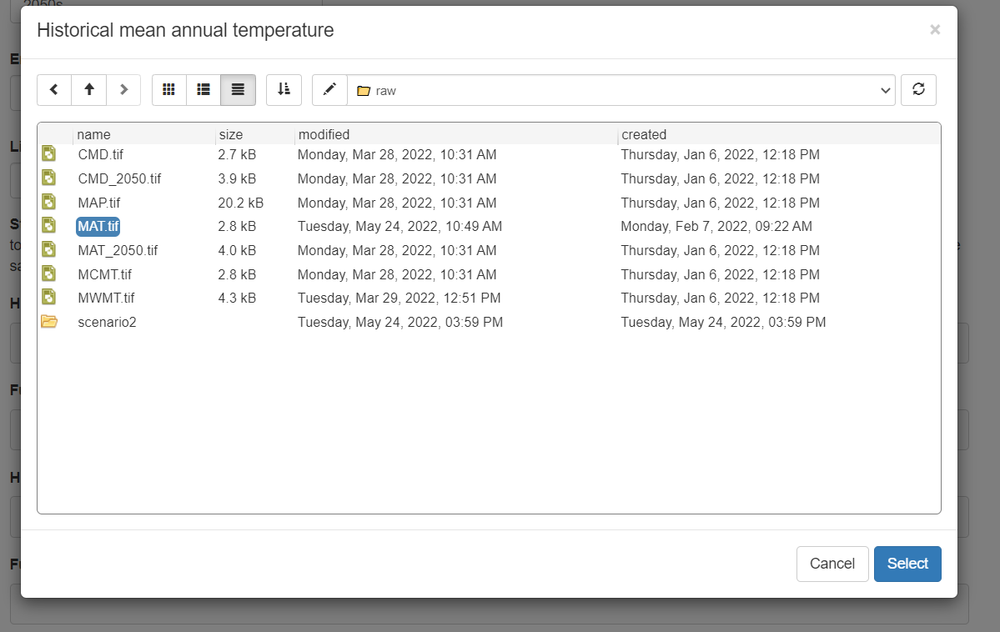
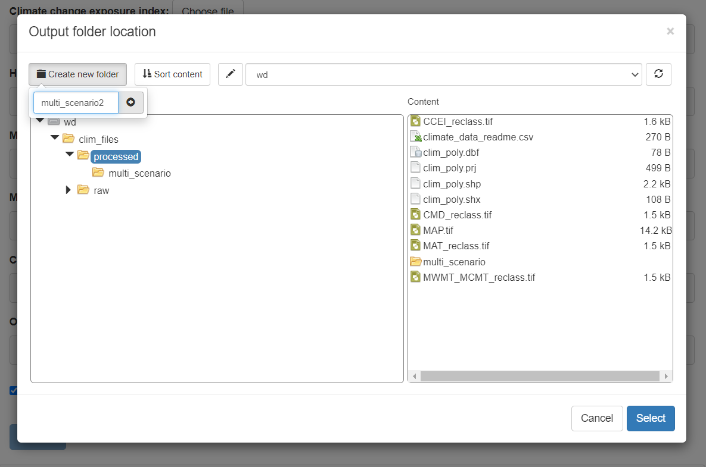

```{r, include = FALSE}
knitr::opts_chunk$set(
  collapse = TRUE,
  comment = "#>"
)
```

### Custom Climate Data
If you wish to use a custom set of climate data to calculate the NatureServe Climate Change Vulnerability Index you will need to prepare the climate data into the form used to calculate the index. The raw climate data set should include rasters of: 
* Mean annual temperature (MAT) for both historical and future time periods
* Climate moisture deficit (CMD) for both historical and future time periods
* Mean annual precipitation (MAP) for the historical time period
* Minimum coldest and warmest month temperatures (MCMT and MWMT) for the historical time period

In addition, the climate change exposure index (CCEI) for South/Central America which is available from [NatureServe](https://www.natureserve.org/ccvi-species) can be included. Climate data for multiple scenarios can be used to calculate the CCVI index for each scenario simultaneously, in which case the MAT and CMD for each future scenario is needed in the raw climate data set. The app will use the raw climate data to create the classified versions of the climate data that are used to calculate the index and save them in the selected folder. 


### Launch the app
The data preparation app is launched by calling the `run_data_prep()` function, which will launch the app in the user's default internet browser. All file selection windows will start in the current working directory. To run the app with data stored in a different folder you can call `run_data_prep()` with the folder path as the first argument. For example, if all of the data is stored in a subdirectory named "data" of the RStudio project where I am calling the function I would call `run_data_prep("data")` to avoid having to open the data folder every time I select a file. Alternatively, the complete path to the data folder can be supplied e.g. "C:/Users/username/Documents/path/to/folder" (Note that paths in R must be supplied using forward slashes). 

### Describe the data
Step 1 in the app explains the data required and some recommended sources of data. For this demonstration we will use the data contained in the app. Step 2 is to describe the data. This information will be stored in the output folder with the processed climate data. It will be used to identify the data set and to list the scenarios included. 

### Select files
Step 3 is to upload the data. For each climate data variable click the "Choose file" button, navigate to the required file and click "Select". 

{width=100%}

The climate data extent polygon is used to clip other polygons to the extent of the climate data. So for climate data covering North America a polygon of the boundaries of North America could be used. If a polygon is not supplied one can be created but the process can be slow.  

Finally, choose a folder to save the processed data to. Make sure this folder is in a convenient place since you will need to supply it every time you use the CCVI app to calculate the index. The folder should be empty or contain climate files that you wish to overwrite. To create a new folder, select the parent folder and click "Create new folder" in the top left corner. Then type the new folder name and click the plus sign. The new folder will appear in the file explorer, click it and then click "Select". 

{width=100%}

Once all the files are selected you can click "Process" to prepare the data. Do not continue until the message says "Processing Complete".

### Multiple scenarios
If you wish to calculate the CCVI for multiple climate change scenarios simultaneously you can create a climate change data set with multiple scenarios in the "Data Preparation for the ccviR app". To do this click on "Add Another Scenario" after the first scenario has completed processing. All scenarios must be processed in one session in order for the same thresholds to be applied for classifying all scenarios. 

The first scenario processed will determine the thresholds used to classify the temperature and moisture exposure based on the median and 1/2 the interquartile range. Therefore, we recommend processing the climate scenario with the lowest impact first so that index values are higher for more extreme scenarios. Steps 2 and 3 must be repeated for each scenario but the values will only be erased for inputs that are expected to change between scenarios or are not required for additional scenarios. MAT and CMD must be provided for the additional scenario. The historical values will not change but must still be supplied since the amount of change is used to inform the exposure. The rest MCMT, MWMT and MAP are not needed for additional scenarios because they are used to inform the species' sensitivity based on its current range and historical climate so they will not change between scenarios. 


